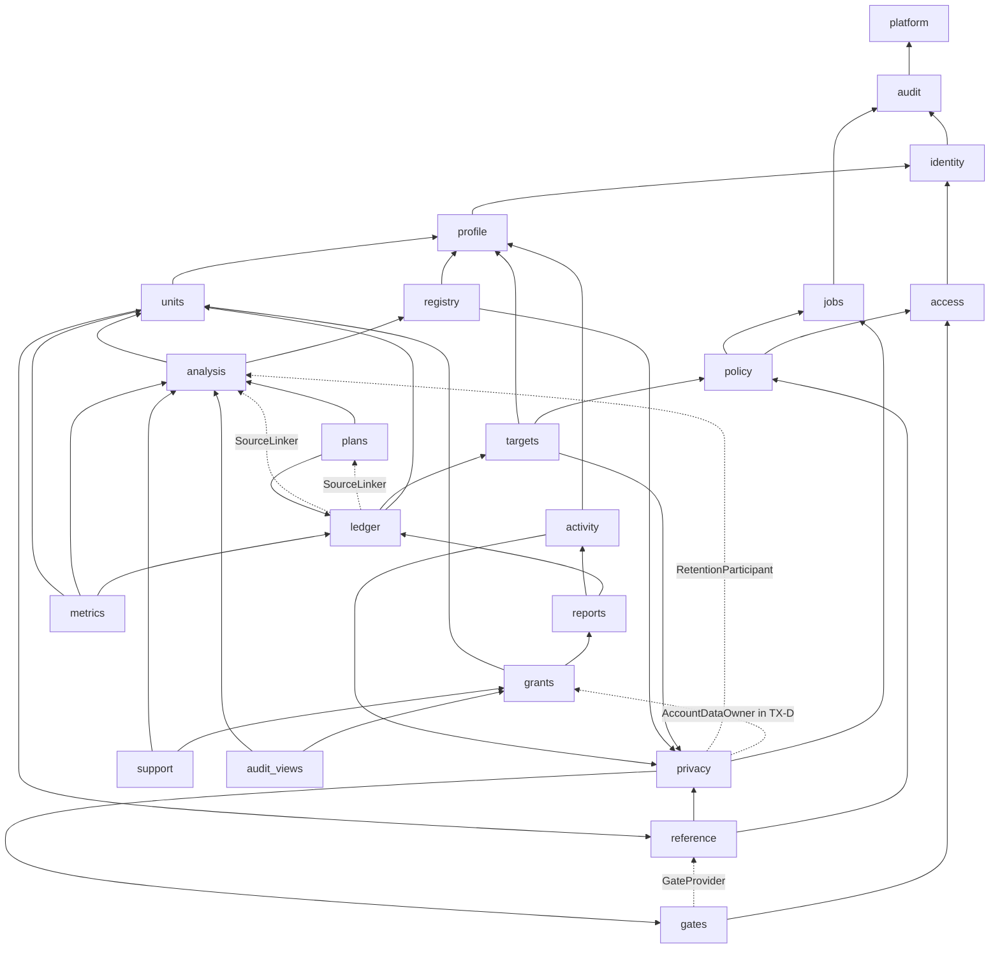

# Model — interactions, data model, decisions, contracts, the dependency map

Written at the model phase, 2026-10-01. Reads `blueprint.md` §0–§3, `vocabulary.md`, `join.md` (the cross-lens decisions), `seed.md` (the one fixture set), `events.md` (the one event catalogue), the lenses in `personas/`, and research cycles 1–3 (`research/`). C1 profile: no scouts, no variation matrix (customization.md: C2 only).

## §1 Interactions on the platform

How the five personas meet through the product, one table per workflow, in the order the work runs. Read with `join.md` (it supersedes lens lines), `events.md` (every event name below is from it) and `seed.md` (every fixture). Columns:

- **screen or interface** — a place from `vocabulary.md` (D2, D4) and the request it sends; paths are FRD §18 and `join.md` J49, and the few this model adds are marked *(new)* and listed in §3.4.
- **data read · data written** — entities of §2 (E-numbers in §2.2). **TX-…** names the transaction the writes share (§2.4); every mutation also writes its **Command record** (E64) in that transaction, so it is not repeated on every row.
- **event raised** — Audit trail events (`events.md` §2) and domain events (`events.md` §3) by their one name; "—" when nothing is written.
- **who is notified** — what changes for another persona without them asking. The product sends no email, SMS or push to staff; the eater gets one notification only for a Grant request, and only if notifications were already allowed (J4). "—" = no one.
- **stories** — every story id appears in at least one row: the five lenses and the six stories of delta D5 (`personas/added-stories.md`) — 629 ids: eater 369, admin 77, approver 70, auditor 61, support 52.

### WF-1 · Onboard and set a target

| # | persona | screen or interface | data read | data written | event raised | who is notified | stories |
|---|---|---|---|---|---|---|---|
| 1.1 | Eater | Onboarding · Age → `POST /v1/age-gate` (the age alone; no account, device or identifier, J32) | Wording `age-1` | Age confirmation (held on the iPhone until an Account or Anonymous session exists, then filed with its Consents) | `age.confirmed` | — | eater-1.1; auditor-9.9 |
| 1.2 | Eater | Onboarding · Under 18 ← 422 `AGE_REQUIREMENT` | — | nothing on the server or the iPhone | `age.refused` (no identifier) | — | eater-1.2 |
| 1.3 | Eater | Onboarding · Consents → `POST /v1/me/consents` (one record per purpose, `method: onboarding_switch`; offline: outbox) | Wording `diary-1`, `c-ai-4`, `health-1`, `mic-1`, `photos-1`, `research-1` | Consent record per purpose decided (Given); an undecided purpose stays **Not given** with no record (J25) — TX-C | `consent.given` (one per purpose; a repeat delivery writes none) | — (the Auditor reads it on Audit trail › Consents) | eater-1.3–1.6; auditor-9.4, 9.6 |
| 1.4 | Eater | Onboarding · Account (Sign in with Apple or email link) → identity on the first verified request | Firebase Auth token, App Check token | Account, Device; the seeded role Eater; Consent `diary_processing` Given by `method: onboarding_choice` ("Keep it in my account") | `consent.given` | — | eater-1.51 |
| 1.5 | Eater (local trial) | Onboarding · Account → "Not now"; Capture & Plan with an anonymous session | App Check token | Anonymous session (its Analyses, daily AI quota count, Age confirmation and Consents only); trial Entries, Units and Templates stay on the iPhone (J124) | `consent.given` (`ai_processing`) | — | eater-1.49, 1.50; admin-10.41 |
| 1.6 | Eater | Today before any Target → the WF-3 and WF-2 rows | Day, Units | as WF-3 3.2 and WF-2 2.9 | as those rows | — | eater-1.7–1.9 |
| 1.7 | Eater | Onboarding · Profile → `PATCH /v1/me/settings` | iPhone region, time zone, language, numerals; Apple Health body mass read on the iPhone (only with `health_read_body_mass` Given) | UserProfile (language, numerals, dialect, display units, time zone, Diary-day boundary 00:00, food exclusions); age, height, weight stay on the iPhone until 1.13 | `settings.changed` | — | eater-1.10–1.15 |
| 1.8 | Eater | Onboarding · Safety screen → `PUT /v1/me/safety-mode` | Policy version in effect (tracking-only triggers, GLP-1 values); Wording `guidance-1` | UserProfile `safety_mode` (standard · tracking_only · protein_first) and screen version — never the answers (J109) | `safety_mode.set` | — | eater-1.16–1.22; approver-10.52 |
| 1.9 | Eater | Onboarding · Energy → `POST /v1/targets/proposals` (writes nothing) | Policy version (activity multiplier × 1.2); the inputs; `nutrition_core.energy` | — | — | — | eater-1.23–1.27 |
| 1.10 | Eater | Onboarding · Target → `POST /v1/targets/proposals` | Policy version (floor, hard stop, loss and gain choices, deficit cap, review interval) | — (`POLICY_FLOOR` with `limit` for an entered value, J100) | — | — | eater-1.28–1.32; approver-10.68 |
| 1.11 | Eater | Onboarding · Macros → `POST /v1/targets/proposals` | Policy default split 30/40/30; the eater's locks | — (`VALIDATION_ERROR` beside the field) | — | — | eater-1.33–1.38 |
| 1.12 | Eater | Onboarding · Activity mode → the Health Consent sheet (`POST /v1/me/consents`) | Policy credit factor 50 %, cap 300 kcal | Consent records for the Health purposes chosen (TX-C) | `consent.given` | — | eater-1.39–1.41 |
| 1.13 | Eater | Onboarding · Review → Approve → `POST /v1/targets` (online only, J111) | the proposal; Policy version | Target version (input snapshot unrounded, resting energy, maintenance, the approved Target to 10 kcal, macro targets, activity mode, credit factor and cap, `policy_version`, `effective_from`, review date) — TX-T | `target.version.approved` | — | eater-1.42–1.45 |
| 1.14 | Eater | Today → `GET /v1/targets/current`, `GET /v1/reports/day` | Target version, Day | — | — | — | eater-1.46 |
| 1.15 | Eater | Settings → Goals → `POST /v1/targets` | Target versions, Policy version | a new Target version; the previous one gets `effective_to`; past Days keep theirs (TX-T) | `target.version.approved` | — | eater-1.47 |
| 1.16 | Nutrition approver → Eater | Policy (console) → Today | Policy version In effect against the Target's `policy_version` | nothing on the Target (never rewritten, J107) | `policy.version.in_effect` | Eater: Today shows "Review my target" (no push) | eater-1.48 |
| 1.17 | Eater (trial → account) | Onboarding · Account → the outbox replays the trial's commands with their original `command_id`s (J88) | trial Units, Templates and Entries on the iPhone; the Account's Units | Units and Unit versions, Templates, Entry events, Entries, Days (TX-U, TX-L) | `unit.version.saved`, `template.saved`, `entry.confirmed`, `day.revised` | — | eater-1.51–1.53 |
| 1.18 | Eater | every Onboarding screen in Arabic, with VoiceOver and the largest text | string catalogue | UserProfile language and numerals | `settings.changed` | — | eater-1.54–1.56 |

### WF-2 · Define a Unit

| # | persona | screen or interface | data read | data written | event raised | who is notified | stories |
|---|---|---|---|---|---|---|---|
| 2.1 | Eater | My Units (or an empty Today) → Unit editor → `GET /v1/units` | the eater's Units (name check) | a Draft on the iPhone only | — | — | eater-2.1–2.3 |
| 2.2 | Eater | Unit editor: kind, name (typed or spoken), picture | `unit_kind` list (FR-009) | Draft on the iPhone | — | — | eater-2.4–2.6 |
| 2.3 | Eater | Unit editor → Source details → `GET /v1/reference/foods?q=` *(new)* | Food versions, Tier B recipe records, Aliases by dialect (J81), the eater's own label records; resolver order FR-025 | — | — | — | eater-2.7–2.9 |
| 2.4 | Eater | Unit editor: weight and how it was measured, part eaten, before/after, average of pieces, volume with density | Food density; Policy component-sum tolerance | Measurement evidence (on the iPhone until Save) | — (`VALIDATION_ERROR` beside the field; ml is never grams) | — | eater-2.10–2.16 |
| 2.5 | Eater | Unit editor (Composite): parts, oil inside, parts against the measured total, no cycle, cereal + milk | Unit versions, Food versions; `nutrition_core.units` | Draft | — (`MASS_BALANCE_ERROR`; `VALIDATION_ERROR` field `components` for a cycle) | — | eater-2.17–2.21 |
| 2.6 | Eater | Settings → Food rules and Unit editor (bread with every dipped bite, exceptions, with/without bread, tea, household defaults) → `PUT /v1/rules` | User rule versions | User rule version n+1 with `effective_from` (no new Unit versions, J75) — TX-U | `rule.version.saved` | — | eater-2.22–2.28 |
| 2.7 | Eater | Unit editor (Recipe): weighed ingredients and the cooked pot → `POST /v1/recipes` | Food versions; `nutrition_core.recipes`; the remembered containers on the iPhone ("big pot · 1,216 g (last time)", device-only, §2.7) | Recipe and Recipe version (ingredients, additions and discards, cooked yield, nutrient vector, assumptions; a range when the pot or the oil is unknown) — TX-U | `unit.version.saved` (`structure: recipe`) | — | eater-2.29–2.33 |
| 2.8 | Eater | Unit editor: calories only, two energy values, a better source, a restaurant item | the eater's own label records, Food versions | Unit version with Evidence user-defined or label-verified; the eater's own label record (a private Food) | — | — | eater-2.34–2.37 |
| 2.9 | Eater | Unit editor → Save unit → `POST /v1/units` | Draft; Food, Recipe and rule versions | Unit, Unit version (immutable; nutrient vector unrounded; Evidence badge), Unit picture, Measurement evidence (raw scan kept 30 days unless "Keep photo with this unit", J76) — TX-U; Today's total unchanged | `unit.version.saved` | — | eater-2.38, 2.39 |
| 2.10 | Eater | My Units: list, search, other names, my own name first, two Units sharing a name | Units, the eater's own names, approved Aliases (J81) | — | — | — | eater-2.40–2.43 |
| 2.11 | Eater | Unit editor → Recalibrate → `POST /v1/units/{id}/versions` | the current version | Unit version n+1; past Entries keep their snapshots (TX-U) | `unit.version.saved` | — | eater-2.44 |
| 2.12 | Eater | correction preview → apply the new weight to Entries the eater picks → WF-6 6.4 | Entries | as WF-6 6.4 | `entry.corrected` | — | eater-2.45 |
| 2.13 | Eater | My Units → Archive / Unarchive → `POST /v1/units/{id}/archive\|unarchive` | Unit | Unit `state` Archived ↔ Saved (J65) | `unit.archived`, `unit.unarchived` | — | eater-2.46 |
| 2.14 | Eater (two iPhones) | Unit editor → `POST /v1/units/{id}/versions` with the expected version | Unit current version | none for the stale command; 409 `STALE_REVISION`, outbox status Conflict | `command.conflict` | — | eater-2.47 |
| 2.15 | Eater | Unit editor with no signal → outbox orders the Unit Save before any consume naming it (J73) | — | as 2.9 when sent | `unit.version.saved` | — | eater-2.48 |
| 2.16 | Eater | My Units after a trial joins the account (as 1.17) | trial Units | Units (merged or "Keep both", J88) | `unit.version.saved` | — | eater-2.49 |
| 2.17 | Nutrition approver → Eater | Foods (console) retires or supersedes a Food version → My Units notice "Update unit" | Food version `state`, the Unit's component versions | nothing on the Unit (snapshots unchanged, J80) | `food.version.retired` · `food.version.approved` | Eater: My Units notice (no push) | eater-2.51 |
| 2.18 | Eater | Unit editor and My Units in Arabic, largest text, VoiceOver, one hand; Hide numbers | UserProfile | — | — | — | eater-2.50, 2.52 |

### WF-3 · Log what I ate

| # | persona | screen or interface | data read | data written | event raised | who is notified | stories |
|---|---|---|---|---|---|---|---|
| 3.1 | Eater | Today (Day picker, timeline, remaining) → `GET /v1/reports/day` | Day, Entries, Target version in effect that Day, Activity Day; Pending commands on the iPhone (J113) | — | — | — | eater-3.1, 3.2, 3.37, 3.38 |
| 3.2 | Eater | Today → a recent Unit → count stepper → Log → `POST /v1/consumption` {`command_id`, `diary_day_id`, `eaten_at`, `items[{unit_version_id, count}]`, `meal_name`} | Unit version (server-resolved snapshot), User rule versions, Consent `diary_processing`, UserProfile boundary | **TX-L**: Entry event(s), Entry, Day with `day_revision` + 1, Command record; answer: `entry_id`, Meal totals, Day totals, `day_revision` | `entry.confirmed`, `day.revised` | — | eater-3.3, 3.4, 3.7, 3.23, 3.43 |
| 3.3 | Eater | Today → Undo → outbox (still Queued: removed) or `POST /v1/consumption/{id}/void` for every Entry of that command (J120) | Entries of the command | TX-L per Void | `entry.voided`, `day.revised` | — | eater-3.5 |
| 3.4 | Eater | Settings → Food rules → One-tap logging → `PATCH /v1/me/settings` | UserProfile | UserProfile `one_tap_logging` | `settings.changed` | — | eater-3.6 |
| 3.5 | Eater | Log with an Archived or another eater's Unit version | Unit version | nothing: 422 `UNIT_NOT_FOUND` (J34); the Entry offers "Unarchive unit" for an offline log (J65) | — | — | eater-3.8 |
| 3.6 | Eater | quick-add: a typed or spoken sentence → `POST /v1/analyses` (Text, Voice) or the Unit-name match `POST /v1/units/name-match` (no AI, J126) → count steppers → Log (3.2) | Units, the eater's names, Aliases; Registry kill switch, daily AI quota, Consent `ai_processing` | Analysis (Text or Voice), as WF-4 4.4 | `analysis.created`, `analysis.state_changed` | — | eater-3.9–3.14 |
| 3.7 | Eater | quick-add → a calorie-only Entry → `POST /v1/consumption` (user override item) | — | TX-L; Evidence user-defined | `entry.confirmed`, `day.revised` | — | eater-3.15 |
| 3.8 | Eater | Day picker → a past Day → Copy a Meal or Copy Day → `POST /v1/consumption` | that Day's Entries; each Unit's latest Saved version ("changed since", J87) | TX-L (one command per Meal or Day) | `entry.confirmed`, `day.revised` | — | eater-3.16–3.18 |
| 3.9 | Eater | My Units → Templates → Save a Meal as a Template → `POST /v1/templates` | Entries of the Meal | Template (Unit ids and counts) — TX-U | `template.saved` | — | eater-3.19 |
| 3.10 | Eater | My Units → Templates → Log (counts changeable first) → `POST /v1/consumption` | Template, latest Unit versions | TX-L | `entry.confirmed`, `day.revised` | — | eater-3.20 |
| 3.11 | Eater | Siri, Shortcuts, the widget → App Intent → the outbox (the widget drops one JSON command file per tap in the App Group, A15) → `POST /v1/consumption` | the eater's Units on the iPhone | TX-L | `entry.confirmed`, `day.revised` | — | eater-3.21, 3.22 |
| 3.12 | Eater | Log the same Unit and count within 10 minutes | recent Entries on the iPhone | as 3.2 (a quiet note, never a block, J118) | `entry.confirmed` | — | eater-3.24 |
| 3.13 | Eater | Today with no signal: Pending shown "incl. n Pending"; back online the outbox sends each command once | outbox (Queued → Sent → Accepted) | TX-L on arrival; a repeat delivery returns the original `entry_id` from the Command record | `entry.confirmed`, `day.revised`; `command.duplicate_ignored` on a repeat | — | eater-3.25–3.27 |
| 3.14 | Eater | Log late at night, in Ramadan, after a boundary change, while travelling | UserProfile boundary versions and time zone; `nutrition_core.days` (the Day assigner, J115) | `diary_day_id` stored as checked | — | — | eater-3.28–3.31 |
| 3.15 | Eater | Today → "Start new day" → `POST /v1/days` | Day | the next Day, opened early (J117) — TX-L | `day.started` | — | eater-3.32 |
| 3.16 | Eater | Day picker → a past Day → Log → `POST /v1/consumption` | Day | TX-L on that Day | `entry.confirmed`, `day.revised` | — | eater-3.33 |
| 3.17 | Eater | the Meal report and the Day report after every Entry | the TX-L answer; `nutrition_core.shares` (largest remainder) | — | — | — | eater-3.34–3.36 |
| 3.18 | Eater | Apple Health: the confirming iPhone writes the food correlation and reports it → `POST /v1/consumption/{id}/health-samples` *(new)* (J123) | Consent `health_write_food` | Entry `health_samples[{sample_id, device_id}]` | `health.sample_written` | — | eater-3.39, 3.40 |
| 3.19 | Eater | Logging one-handed, at the largest text, with VoiceOver, in Arabic, with Hide numbers | UserProfile | — | — | — | eater-3.41, 3.42 |
| 3.20 | Support agent | Jobs › account panel › Sync → `GET /v1/support/accounts/{id}/sync` | Command records (conflicts, duplicates ignored), Devices — never Entry content | — | `account.jobs_viewed` | — | support-3.1, 3.2 |

### WF-4 · Capture and analyse

| # | persona | screen or interface | data read | data written | event raised | who is notified | stories |
|---|---|---|---|---|---|---|---|
| 4.1 | Eater | Capture & Plan opens on the camera; capture modes Meal · Unit · Label · Recipe → `GET /v1/analyses/availability` *(new)* | Registry task kill switches (propagation ≤ 10 s, J94) | — | — | — | eater-4.1, 4.2 |
| 4.2 | Eater | the sheet at first need → `POST /v1/me/consents` (`method: first_need_sheet`, `context: Capture & Plan`); withdraw in one tap | Wording `c-ai-4`, `photos-1`, `mic-1` | Consent records (TX-C) | `consent.given`, `consent.withdrawn` | — | eater-4.3–4.6 |
| 4.3 | Eater | camera: frame, crop, strip EXIF, keep the capture time; poor-photo advice; people not described | — | Analysis media on upload (raw scan, `delete_after` 30 days; audio 24 h) | — | — | eater-4.7–4.9 |
| 4.4 | Eater | photo + words → `POST /v1/analyses` {`command_id`, mode, words, `captured_at`, `diary_day_id`} → server: Consent `ai_processing`, daily AI quota (Quotas version), kill switch, Registry version (Rollout or the eater's Canary bucket), `Analyzer` (`store=False`; no account identifier, no Health data), validation, resolver | Units and their names (chips from the eater's Units first), Food versions, Aliases, Tier B recipe records, User rule versions | Analysis (Processing → Needs answers · Ready for review · Failed) with its stamp (Registry version, model, prompt version, schema version 3, nutrition algorithm and source versions); daily AI quota count; AI request record — TX-A | `analysis.created`, `analysis.state_changed` | — | eater-4.10–4.13, 4.51, 4.52; admin-10.28 |
| 4.5 | Eater | Analysis review: at most two questions in the Analysis's life → `POST /v1/analyses/{id}/answers` *(new)* | Analysis questions (J127; "Which one? A or B", J128) | Analysis answers, state | `analysis.question_answered`, `analysis.state_changed` | — | eater-4.14–4.16, 4.19, 4.30 |
| 4.6 | Eater → Nutrition approver | Analysis review shows a stand-in food as one; missing macros as missing | Food versions; resolver | Flag (Estimated analogue · Unmatched name) `eaters_affected` count, de-identified | — | Nutrition approver: Review › flags counts (in place) | eater-4.17, 4.18 |
| 4.7 | Eater | Analysis review: change, add, remove chips | Units, Food versions | the Analysis's chips on the iPhone until Approve | — | — | eater-4.20 |
| 4.8 | Eater | Analysis review → Approve → `POST /v1/consumption` with `source_analysis_id` | Analysis; Unit and Food versions named by the chips (refused when invented or foreign: `UNIT_NOT_FOUND`, J34) | **TX-L** + the Analysis → Approved in the same transaction; the same photo twice is one Meal (Command record) | `entry.confirmed`, `day.revised`, `analysis.state_changed` | — | eater-4.21, 4.23, 4.24 |
| 4.9 | Eater | Analysis review → Discard → `POST /v1/analyses/{id}/discard` *(new)* | Analysis | Analysis → Discarded (an end, J66) | `analysis.state_changed` | — | eater-4.22 |
| 4.10 | Eater | Capture & Plan: intent of words — a correction («١٨ مش ١٥», WF-6), "calculate and save my bite" (WF-2 2.9, nothing logged), "add another 3" (3.2), "Start a new day" (3.15) | Analysis (Text) | as the row it leads to | as the row it leads to | — | eater-4.25–4.29 |
| 4.11 | Eater | a table photo: "Plan a meal" or "Log what I ate" (J125); my portion from the table | Analysis | Analysis (shared dishes start at "My portion: 0") | `analysis.state_changed` | — | eater-4.31, 4.32 |
| 4.12 | Eater | Unit mode / Scale: one bite on the scale → a Unit Draft (task Scale) | Analysis | Analysis; Measurement evidence (display value, unit, tare) to the Unit editor | `analysis.created` | — | eater-4.33, 4.34 |
| 4.13 | Eater | Label mode (task Label): fields read, unsure digits shown, bases lined up | Analysis | the eater's own label record and a Unit version via 2.9 | `analysis.created` | — | eater-4.35, 4.36 |
| 4.14 | Eater → Nutrition approver | Label mode → "Send my label photos for review" → `POST /v1/label-submissions` (needs Consent `label_review`, J29) | Consent `label_review` | Label submission (Proposed), a Proposed Food version (`origin: label_submission`), photos cropped and EXIF-stripped | `food.version.proposed` | Nutrition approver: Review › Label submissions count | eater-4.37 |
| 4.15 | Eater | Recipe mode (task Ingredients): a recipe page or a spoken recipe → ingredients to weigh → WF-2 2.7 | Analysis | Analysis | `analysis.created` | — | eater-4.38 |
| 4.16 | Eater | voice (task Voice, then Text): words shown first; numbers, pairs, halves; Gulf words marked; Latin letters; approved Units by voice → quick confirm or one tap with Undo | Units, Aliases | Analysis; audio deleted within 24 h | `analysis.created`, `analysis.state_changed` | — | eater-4.39–4.44 |
| 4.17 | Eater | words printed in a photo are data; nothing from Apple Health reaches the `Analyzer` | — | — (`VALIDATION_ERROR` for a Health field) | — | — | eater-4.45, 4.46 |
| 4.18 | Eater | AI down or the kill switch On: 503 `AI_UNAVAILABLE` (nothing queued); logging from My Units, a Template or an amount still works | Registry task | Analysis → Failed (`code`) | `analysis.state_changed` | — | eater-4.47 |
| 4.19 | Eater | today's AI limit → 429 `RATE_LIMITED` with `resets_at` (the eater's diary day, J91) | daily AI quota count, Quotas version | — | — | — | eater-4.48 |
| 4.20 | Eater | a photo with no signal stays Pending on the iPhone; approved later it lands on the capture time's Day (J122) | outbox | as 4.4 and 4.8 on arrival | `analysis.created` | — | eater-4.49 |
| 4.21 | Eater | capture and review one-handed, in Arabic, large text, VoiceOver, sun and night; Hide numbers | UserProfile | — | — | — | eater-4.50, 4.53 |
| 4.22 | Support agent | Jobs › account panel › Failed Analyses → `GET /v1/support/accounts/{id}/failed-analyses` | Analysis metadata (state, `code`, stamp, time), daily AI quota count — never media or chips | — | `account.jobs_viewed` | — | support-4.1–4.3 |
| 4.23 | Platform admin | Jobs (failed AI jobs, de-identified) → Retry → `POST /v1/admin/jobs/{id}/retry`; stop at 5 of 5 | Job, Analysis metadata | a new Analysis with `retry_of`, under the same command id (J66); Job attempts | `job.retried` | — | admin-10.55–10.57 |

### WF-5 · Plan a meal and confirm it

| # | persona | screen or interface | data read | data written | event raised | who is notified | stories |
|---|---|---|---|---|---|---|---|
| 5.1 | Eater | Capture & Plan → Plan a meal: a table photo (WF-4 4.11), a list, an unknown dish (≤ 2 questions, then leave it out or make a Unit) | Analysis, Units | — | — | — | eater-5.1–5.3 |
| 5.2 | Eater | Meal planner: amounts available, Calorie aim or Calorie ceiling, carbohydrate maximum, protein minimum, exclusions, must-include foods, preference shares, whole counts / halves / grams, bread with every dipped bite | UserProfile (exclusions, halves, grams), Unit versions, User rule versions, Day (what is left today, J132), Target version, Policy (planner increments, limits withheld in tracking-only) | — (`VALIDATION_ERROR` beside the field) | — | — | eater-5.4–5.13 |
| 5.3 | Eater | Meal planner → Find counts → `POST /v1/meal-plans` → CP-SAT, then `nutrition_core.plans.verify_plan` on unrounded values | as 5.2 | Plan: Proposed (counts, `selected_versions`, verified totals) or Infeasible (`blocking[]`, `changes[]`); a solve with no answer in time makes no Plan (`solution_status: unknown`, J68) — TX-P | `plan.proposed` | — | eater-5.14–5.17, 5.21–5.24, 5.44 |
| 5.4 | Eater | Meal planner: the explanation (task Explain) | the verified Plan only; Registry, daily AI quota (Text and Voice) | Plan `explanation`; AI request record | — | — | eater-5.19 |
| 5.5 | Eater | Meal planner: nudge a count, change a limit → `POST /v1/meal-plans/{id}/validate`, `POST /v1/meal-plans` | Plan | Plan (re-checked) | `plan.proposed` | — | eater-5.18, 5.20 |
| 5.6 | Eater | Meal planner below the floor or the hard stop; a day plan; over the Target today; tracking-only | Policy, Target version, UserProfile `safety_mode` | — (`POLICY_FLOOR`, J131) | — | — | eater-5.25–5.27 |
| 5.7 | Eater | Meal planner → Save plan → `POST /v1/meal-plans/{id}/save` | Plan | Plan → Saved (counts zero; `PLAN_INFEASIBLE` for an Infeasible Plan, J38) — TX-P | `plan.saved` | — | eater-5.28 |
| 5.8 | Eater | Meal review → Ate as planned → `POST /v1/consumption` with `source_plan_id` | Plan `selected_versions` (J130) | **TX-L** + the Plan → Confirmed (`confirmed_as: ate_as_planned`, Entry ids) in the same transaction; a second confirm returns the first result | `entry.confirmed`, `day.revised`, `plan.confirmed` | — | eater-5.29, 5.30, 5.35, 5.37, 5.38 |
| 5.9 | Eater | Meal review → Change amounts, two extra egg bites, a partial meal and leftovers → Save consumed | Plan | TX-L + Plan → Confirmed (`confirmed_as: changed`) | `entry.confirmed`, `day.revised`, `plan.confirmed` | — | eater-5.31–5.33 |
| 5.10 | Eater | Meal review → Not eaten → `POST /v1/meal-plans/{id}/not-eaten`; Undo → Saved (its Entries Voided, J68) | Plan | Plan → Not eaten → Saved (TX-P; Undo of a Confirmed Plan is TX-L) | `plan.not_eaten`, `plan.reopened` | — | eater-5.34 |
| 5.11 | Eater | Entry details → correct a Confirmed Plan's Meal (WF-6 6.4) | Entry `source_plan_id` | TX-L; the link stays | `entry.corrected` | — | eater-5.36 |
| 5.12 | Eater | Meal planner with no network: chips and limits editable, Find counts disabled ("Needs a connection"); a table photo taken offline stays a Pending Analysis; the list survives a restart | the half-built list on the iPhone | — | — | — | eater-5.39 |
| 5.13 | Eater | AI unavailable, timed out or quota used: planning from Units still works | Units, Registry | as 5.3 without 5.4 | `plan.proposed` | — | eater-5.40 |
| 5.14 | system (scheduler) → Eater | a Saved Plan expires at the end of its Day (the diary-day boundary, J130); it stays Saved with `expired_at` (J150); its card on Today (J152) reads "From <Day> · not logged" with "Plan again" only; `GET /v1/meal-plans?state=saved` omits it, `&include_expired=true` lists it | Plan, UserProfile boundary | Plan `expired_at` (no state change) | `plan.expired` | Eater: the Today card changes (no push) | eater-5.45 |
| 5.15 | Eater | the Meal planner in Arabic, right to left, one thumb, large text, VoiceOver; Hide numbers (counts only, J110) | UserProfile | — | — | — | eater-5.41–5.43 |
| 5.16 | Eater | Today → "Plan again" refills Meal planner for the new Day without solving (J149); a confirmation reaching the server late → `POST /v1/consumption` with `source_plan_id` and the device's `made_at` | Plan (`expired_at`, `selected_versions`), the command's `made_at` | made before `expired_at`: TX-L once onto the Plan's Day (J151); made after: nothing — 409 `VALIDATION_ERROR` `reason: plan_expired` (J149) | `entry.confirmed`, `day.revised`, `plan.confirmed` (when accepted) | — | eater-5.45 |

### WF-6 · Correct history

| # | persona | screen or interface | data read | data written | event raised | who is notified | stories |
|---|---|---|---|---|---|---|---|
| 6.1 | Eater | timeline → Entry details → `GET /v1/consumption/{id}/history` | Entry, its Entry events (the Entry history, J22), snapshot, Source details | — | — | — | eater-6.1, 6.25 |
| 6.2 | Eater | say or type the correction ("18 not 15", «١٨ مش ١٥», "remove the laban") → Analysis (Text, Voice) finds the Entry | Entries of the Day, Units | Analysis | `analysis.created` | — | eater-6.2, 6.5, 6.6, 6.16 |
| 6.3 | Eater | correction preview: old, new, the Meal's change, the Day's change, the Day and its time zone | Entry, Day; `nutrition_core` | — | — | — | eater-6.3, 6.20 |
| 6.4 | Eater | correction preview → Confirm → `POST /v1/consumption/{id}/corrections` {`command_id`, `expected_entry_version`, count · grams · Unit version · `eaten_at` · `diary_day_id`, `scope`} | Entry (version check → `STALE_REVISION`), Unit version, both Days on a move | **TX-L**: Entry event (`operation` correct · move, `supersedes`), Entry version + 1, each affected Day revised; `scope: future_default` also moves the Unit's default version in the same transaction | `entry.corrected`, `day.revised` | — | eater-6.4, 6.7, 6.8, 6.10, 6.17, 6.18 |
| 6.5 | Eater | correction preview → Undo | the Correction's Entry event | TX-L (a Correction back to the earlier values) | `entry.corrected`, `day.revised` | — | eater-6.9 |
| 6.6 | Eater | apply a new measurement to past Entries the eater picks; quick paths then log the new default; a better source never rewrites the past | Entries, Unit versions, Food version `state` (J80) | TX-L per Entry picked | `entry.corrected`, `day.revised` | — | eater-6.11–6.13 |
| 6.7 | Eater | Entry details → Void (Undo, no warning) → `POST /v1/consumption/{id}/void`; a retry never subtracts twice | Entry | TX-L | `entry.voided`, `day.revised` | — | eater-6.14 |
| 6.8 | Eater | Day report → Voided Entries → Restore → `POST /v1/consumption/{id}/restore` | Entry | TX-L | `entry.restored`, `day.revised` | — | eater-6.15 |
| 6.9 | Eater | a correction with no signal waits as Pending; two iPhones changed one Entry; a Void meets a Correction | outbox; Entry version | the first command wins (TX-L); the other is 409 `STALE_REVISION`, outbox status Conflict, waiting for the eater's choice (J69) | `command.conflict` | — | eater-6.21–6.23 |
| 6.10 | Eater | Apple Health follows every Correction, Void, Restore and move: the confirming iPhone rewrites or deletes its sample (J123) | Entry `health_samples` | Entry `health_samples` | `health.sample_rewritten`, `health.sample_deleted` | — | eater-6.24 |
| 6.11 | Eater | Progress after a late edit: the period views change; old Targets stay | Days, Target versions per Day | — | — | — | eater-6.19 |
| 6.12 | Eater | correcting with VoiceOver, large text, in Arabic | UserProfile | — | — | — | eater-6.26 |
| 6.13 | Support agent | Jobs › Sync: "Conflict · waiting for the eater's choice" | Command records | — | `account.jobs_viewed` | — | support-3.1 |

### WF-7 · Activity

| # | persona | screen or interface | data read | data written | event raised | who is notified | stories |
|---|---|---|---|---|---|---|---|
| 7.1 | Eater | Activity sheet (from Today's Activity row) → the Health sheet at first need, type by type → `POST /v1/me/consents` | Wording `health-1` | Consent records `health_read_workouts`, `health_read_active_energy`, `health_read_body_mass` (TX-C) | `consent.given` | — | eater-7.1 |
| 7.2 | Eater | Activity sheet: "No data from Apple Health yet", never "denied" (J31); where the data starts | HealthKit on the iPhone | — | — | — | eater-7.2, 7.3 |
| 7.3 | Eater | app opens → import → `POST /v1/activity/import` {batch: workouts, active energy per Day, body mass} | Activities (`provider_record_id`, interval overlap), Active energy, Weights | **TX-V**: Activities (Confirmed; updated or removed when changed or deleted in Health), Active energy, Weights, Activity import record, Activity Days | `activity.import_reconciled`, `activity.confirmed`, `weight.recorded` | — | eater-7.4–7.7, 7.9, 7.10 |
| 7.4 | Eater | Health data never goes to the AI | — | — | — | — | eater-7.8 |
| 7.5 | Eater | Activity sheet → Add an Activity by hand → `POST /v1/activity`; a match asks to link → `POST /v1/activity/{id}/link` | Activities | Activity (`origin: manual`; gross converted, J50 `energy_basis`) — TX-V | `activity.confirmed`, `activity.linked` | — | eater-7.11–7.13 |
| 7.6 | Eater | Activity sheet → correct, Void, Restore → `/v1/activity/{id}/corrections\|void\|restore` | Activity | Activity, Activity Day (TX-V) | `activity.corrected`, `activity.voided`, `activity.restored` | — | eater-7.14, 7.15 |
| 7.7 | Eater | Today in Fixed mode: the food Target does not grow; exercise never changes what was eaten | Target version, Activity Day, Day | — | — | — | eater-7.16, 7.17 |
| 7.8 | Eater | Settings → Activity → Activity mode → Activity-adjusted: base, credit factor, cap (lowered, never raised) → Approve → `POST /v1/targets` | Policy credit factor and cap, Target version | a new Target version (`activity_mode`, `credit_factor`, `credit_cap_kcal`) — TX-T | `target.version.approved` | — | eater-7.18 |
| 7.9 | Eater | Today and the Activity sheet: the Activity-adjusted budget step by step, what each number means, coverage and last sync, a late workout | `GET /v1/reports/day`: Activity Day, Target version, Day; `nutrition_core.activity` | — | — | — | eater-7.19–7.22 |
| 7.10 | Eater | Settings → Privacy → withdraw a Health read purpose: "Keep what was imported" or "Delete imported …" (J31) | Consent records | Consent record (Withdrawn); deleting removes those Activities, Active energy or Weights and re-projects the Activity Days — TX-C then the Consent-withdrawal Privacy job | `consent.withdrawn`, `privacy_job.requested`, `privacy_job.completed` | — | eater-7.24 |
| 7.11 | Eater | Activity in Arabic, with VoiceOver, with numbers hidden | UserProfile | — | — | — | eater-7.23 |
| 7.12 | Support agent | Jobs › account panel › Activity → `GET /v1/support/accounts/{id}/activity` | Activity import records (counts, times) — never values | — | `account.jobs_viewed` | — | support-7.1 |
| 7.13 | Nutrition approver → Eater | a newer Policy In effect offers a different activity credit → Settings → Activity → Activity mode: "New activity credit available: <factor> % up to <cap> kcal — Review" → `GET /v1/targets/activity-credit-offer`; Review → Approve (lower, never raise) → `POST /v1/targets/activity-credit-offer/approve`; Cancel changes nothing (J103, J156) | Policy version In effect, the Target version (`credit_factor`, `credit_cap_kcal`, `policy_version`) | on Approve a new Target version (same base and source, the offer's `policy_version`) — TX-T; the previous one is never rewritten (J107) | `target.version.approved` | Eater: the offer line in Settings → Activity (no push) | eater-7.25 |

### WF-8 · Reports and progress

| # | persona | screen or interface | data read | data written | event raised | who is notified | stories |
|---|---|---|---|---|---|---|---|
| 8.1 | Eater | the Meal report after a confirmed Meal | TX-L answer | — | — | — | eater-8.1 |
| 8.2 | Eater | Today → remaining → Day report → `GET /v1/reports/day` | Day (Confirmed totals only, J113), Entries, Target version effective that Day, Activity Day, Policy (carbohydrate labels); `nutrition_core.shares` | — | — | — | eater-8.2–8.7, 8.32–8.34 |
| 8.3 | Eater | the Day report reconciles: Day rebuilt from its Entry events equals the stored Day | Entry events, Day | — | — | — | eater-8.8, 8.9, 8.35 |
| 8.4 | Eater | Progress: 7 days, 28 days or custom dates → `GET /v1/reports/period` | Days, Target versions per Day, marks, coverage | — (`VALIDATION_ERROR` for wrong dates) | — | — | eater-8.10–8.12, 8.14–8.18 |
| 8.5 | Eater | Day report → Mark Day complete → `PUT /v1/days/{diary_day_id}/mark` {`mark`, `expected_revision`} | Day | Day `mark` (Complete ↔ Partial), revision + 1 — TX-L | `day.marked` | — | eater-8.13 |
| 8.6 | Eater | Progress → Weight → `GET /v1/weights` *(new)*; Add weight → `POST /v1/weights`; Exclude from trend → `PATCH /v1/weights/{id}` | Weights | Weight (`source: manual`), `outlier_state` | `weight.recorded`, `weight.excluded` | — | eater-8.19–8.22 |
| 8.7 | Eater | Progress → Target history → `GET /v1/targets` | Target versions (row details: method, Activity × 1.2, Policy version) | — | — | — | eater-8.23 |
| 8.8 | Eater | Progress → Export period → `GET /v1/reports/period?format=csv\|json` (Western digits, ISO dates, J137); offline or failed | Days, Target versions | — | — | — | eater-8.24, 8.25 |
| 8.9 | Eater | Progress before the first Entry, offline or slow | cached Days on the iPhone | — | — | — | eater-8.26, 8.27 |
| 8.10 | Eater | reports in Arabic, with Hide numbers, in tracking-only mode | UserProfile | — | — | — | eater-8.28–8.30 |
| 8.11 | Eater | Progress → a Suggested Target → `GET /v1/targets/suggestions`; Accept → `POST /v1/targets/suggestions/{id}/accept`; Keep | Days (Complete only), Weights, Target version, Policy Suggested Target bounds | Suggested Target; on Accept a Target version (`source: suggestion`) — TX-T | `target.suggestion.created`, `target.suggestion.accepted`, `target.suggestion.kept`, `target.version.approved` | — | eater-8.31 |
| 8.12 | Nutrition approver | Metrics → `GET /v1/admin/metrics/evidence` (fewer than 11 eaters hidden, J44) | Metrics roll-ups by Evidence badge | — | — | — | approver-10.19 |

### WF-9 · Privacy

| # | persona | screen or interface | data read | data written | event raised | who is notified | stories |
|---|---|---|---|---|---|---|---|
| 9.1 | Eater | Settings → Privacy → `GET /v1/me/consents`; the privacy policy in the eater's language | Consent records (Not given derived), Wording | — | — | — | eater-9.1, 9.9, 9.10 |
| 9.2 | Eater | Settings → Privacy → withdraw the AI Consent (one tap) → `POST /v1/me/consents` | Consent records | **TX-C**: Consent record (Withdrawn) + Privacy job (`kind: consent_withdrawal`) + Job; the job cancels Pending Analyses, purges queued uploads, deletes cached analyses, photos and audio, and prepared export files (AT-29) | `consent.withdrawn`, `privacy_job.requested`, `privacy_job.completed` | — | eater-9.2; auditor-9.5 |
| 9.3 | Eater | Settings → Privacy, or the sheet at first need → give a Consent again | Wording | Consent record (Given) — TX-C | `consent.given` | — | eater-9.3 |
| 9.4 | Eater | withdraw Health (keep or delete, as WF-7 7.10), Microphone or Photos; offline: applies at once on the iPhone and is recorded once | Consent records | Consent record (TX-C) | `consent.withdrawn` | — | eater-9.4–9.6; auditor-9.7 |
| 9.5 | Eater | withdraw Diary processing → one confirmation → export offered → deletion of the account's server copy (J30) | Consent records | TX-C + a deletion Privacy job (as 9.13) | `consent.withdrawn`, `privacy_job.requested` | — | eater-9.7 |
| 9.6 | Eater → Platform admin | withdraw Optional research → the regression set job removes the eater's cases (J28) | Consent records, regression cases | Consent record; regression case removed | `consent.withdrawn`, `regression_case.removed` | — | eater-9.8 |
| 9.7 | system (retention job, hourly, J143) | Analysis media cropped, EXIF-stripped, encrypted, private (short-lived signed access, FR-077); Jobs › Retention | Analysis media and Measurement evidence ages; Policy retention | raw scans older than 29 d 23 h and audio older than 23 h deleted; Retention run record (a Job record, not an event) | — | Platform admin: Jobs flags an overdue run | eater-9.11, 9.12; auditor-9.15; admin-9.4 |
| 9.8 | Eater | diagnostic logs carry no profile, Target or Consent values (A20 allow-list) | — | operational logs (30 days) | — | — | eater-9.13 |
| 9.9 | Eater | Settings → Export → `POST /v1/privacy/export-or-delete` {`kind: export`} → `GET /v1/privacy/jobs/{id}`; download → `GET /v1/privacy/jobs/{id}/file` | every module's export section (J139) | Privacy job + Job (TX-J); Export file kept 7 days (J140) | `privacy_job.requested`, `privacy_job.completed`, `privacy_job.export_downloaded` | — | eater-9.14–9.16; auditor-9.14 |
| 9.10 | Eater (local trial) | Settings → Export and Delete on the iPhone only | trial diary | — | — | — | eater-9.17, 9.22 |
| 9.11 | Eater | Settings → Privacy → Delete account → one warning → `POST /v1/privacy/export-or-delete` {`kind: deletion`} (online only; Pending food goes with it) | Account, Grants | **TX-D**: Privacy job (`reference` DEL-…, `due_by` + 30 days) + Job + every Requested or Active Grant → Withdrawn (`reason: account_deletion`, J11) | `privacy_job.requested`, `grant.withdrawn` | Support agent: a Grant panel turns Withdrawn (in place) | eater-9.18, 9.20 |
| 9.12 | system (deletion job) | Jobs › Privacy jobs: the stages of J141 — signed out and disabled · private records · photos and audio · caches · queued commands · prepared exports · Grants withdrawn · processors told (`ProcessorNotice`, no eater identifier) · processor confirmation · Sign in with Apple revoked · completion record | every module's `delete_account_data` | each module deletes its own records; the Account is removed; Completion record (no identifiers; "backups expire by …") | `privacy_job.completed` · `privacy_job.failed` | Platform admin: Jobs lists a Failed stage first by its due date | eater-9.19, 9.21; auditor-9.10–9.13 |
| 9.13 | Eater | Settings → Privacy → Support code → `POST /v1/me/support-code` | — | Support code (valid 24 h) | `support_code.issued` | — | eater-9.23 |
| 9.14 | Eater | Privacy in Arabic, VoiceOver, the largest text | UserProfile | — | — | — | eater-9.24 |
| 9.15 | Support agent | console sign-in → `POST /v1/admin/session` (password + authenticator); idle sign-out at 15 min | Staff account, Role assignments | Staff session | `staff.signed_in`, `staff.sign_in_failed`, `staff.sign_in_locked`, `staff.session_ended` | — | support-9.1 |
| 9.16 | Support agent | Jobs › Look up an account → `POST /v1/support/lookups` (support code, or exact email with a case reference, ≤ 30 an hour) | Support code, Account (the email is matched inside identity) | email look-up limit count | `account.lookup`, `account.lookup_rate_limited` | — | support-9.2, 9.3 |
| 9.17 | Support agent | Jobs › account panel → `GET /v1/support/accounts/{id}` (allow-list only) | Account, Devices, UserProfile (language, numerals, zone, boundary), Consent states, daily AI quota count, Privacy jobs, Grants, Label submission states (J85) | — | `account.viewed` | — | support-9.4–9.7 |
| 9.18 | Support agent | Jobs › Privacy jobs → `GET /v1/support/accounts/{id}/privacy-jobs`; Jobs › Privacy help (where export and delete sit in the app) | Privacy jobs, Jobs | — | `account.jobs_viewed` | — | support-9.8, 9.10, 9.13 |
| 9.19 | Support agent | Jobs › Privacy jobs → Retry a Failed export once → `POST /v1/admin/jobs/{id}/retry` | Job (attempt budget 5, J142) | Job attempts | `job.retried` | — | support-9.9 |
| 9.20 | Support agent → Platform admin | Jobs › Privacy jobs → Escalate → `POST /v1/admin/jobs/{id}/escalate` (case reference) | Job | Job `escalated` | `job.escalated`, `job.escalation_resolved` | Platform admin: Jobs › Escalated | support-9.11 |
| 9.21 | Support agent | Look up by deletion reference | Completion record | — | `account.lookup` | — | support-9.12 |
| 9.22 | Support agent → Platform admin | Jobs › Requests received outside the app → `POST\|PATCH /v1/support/outside-requests[/{id}]` → escalate; the Platform admin verifies by a one-time link to the account's own sign-in email and acts → `POST /v1/admin/outside-requests/{id}/act` (J43) | Account | Request received outside the app (Open → Escalated → Closed); a Privacy job (`requested_by: staff`, `channel: outside_app`, `verified_by: email_link`) | `outside_request.recorded`, `outside_request.escalated`, `outside_request.closed`, `privacy_job.requested` | Platform admin: Jobs › Escalated; due soon at ≤ 7 days (J45) | support-9.14, 9.15 |
| 9.23 | Support agent | stays inside the role; one account at a time; every act on the trail; desk and phone width; Arabic; slow, failing or offline jobs | Role assignments | — (403 `FORBIDDEN`) | `access.refused` | — | support-9.16–9.21 |
| 9.24 | Platform admin | Jobs: failed deletions first with their deadline; retry an export once and get one export; a retry re-checks the account and the Consent first | Jobs, Privacy jobs (de-identified) | Job attempts | `job.retried`, `privacy_job.failed` | — | admin-9.1–9.3 |
| 9.25 | Auditor | Audit trail › Consents and one account's history → `GET /v1/admin/audit-trail/consents`; Settings › Wordings read-only → `GET /v1/admin/wording/versions` (J159) | Consent records (counts by purpose; "Not given by anyone yet"), Wording versions and states, Audit trail events | — | `audit_trail.queried` | — | auditor-9.1–9.3, 9.18 |
| 9.26 | Auditor | Audit trail › Records of processing; Exports → `POST /v1/admin/audit-trail/exports` | Wording, Policy retention, Registry processors (J20) | Audit trail export (manifest, `sha256`) | `audit_trail.queried`, `audit_trail.exported` | — | auditor-9.16, 9.17 |
| 9.27 | Auditor | Audit trail › Anomalies: raw evidence never opened by staff | Audit trail events (`access.refused` with `analysis_media`) | — | `audit_trail.queried` | — | auditor-9.8 |
| 9.28 | Eater | the next use of a purpose after a Wording published with `asks_again` (J154): the Consent sheet shows the new text; until decided, `POST /v1/analyses` → 403 `CONSENT_REQUIRED`; with `asks_again: false` an earlier Consent stays valid under its own version → `GET /v1/me/consents` (`text_version_in_force`, `asks_again`) | Consent records, Wording in force (`asks_again`) | Consent record under the new version (TX-C) | `consent.given` | — | admin-10.73 |

### WF-10 · Govern the reference and the AI (and just-in-time access)

One table, in six parts: **A** reference (Nutrition approver), **B** Policy (Nutrition approver), **C** Registry, quotas and cost (Platform admin), **D** roles, launch gates and Wordings (Platform admin), **E** Grants and Grant settings (Support agent, Eater, Platform admin), **F** the Audit trail (Auditor).

| # | persona | screen or interface | data read | data written | event raised | who is notified | stories |
|---|---|---|---|---|---|---|---|
| 10A.1 | Nutrition approver | Review (flags, Label submissions; sort by impact; keyboard; empty or failed) → `GET /v1/admin/flags?open=true`; staff session as 9.15 | Flags, Label submissions, Food versions | — | `staff.signed_in` | — | approver-10.1, 10.3–10.8 |
| 10A.2 | Nutrition approver | Review → Claim → `POST /v1/admin/foods/{id}/versions/{v}/claim` | Food version | Food version → In review (`claimed_by`) | `food.version.claimed` | another approver: the row reads "Claimed by …" | approver-10.9 |
| 10A.3 | Nutrition approver | Review › flags: an estimated analogue → its own Food, keep the analogue with a reason, a substituted preparation | Flag, Food versions | Food version (Proposed → Approved), Flag → Closed (`decision`) | `food.version.proposed`, `food.version.approved`, `flag.closed` | — | approver-10.10–10.12 |
| 10A.4 | Nutrition approver | Review › flags: Energy mismatch — keep the label's value, or a transcription error | Flag, Policy energy-mismatch threshold | Flag → Closed; Food version n+1 | `flag.closed`, `food.version.approved` | — | approver-10.13, 10.14 |
| 10A.5 | Nutrition approver | Review › Label submissions: approve, open the raw photos safely, reject, a repeated barcode | Label submission, its photos (signed, short-lived), Consent `label_review` | Label submission → Approved · Rejected; Food version; photos kept or deleted (J29) | `food.version.approved`, `food.version.rejected` | Eater: the submission's state (no push) | approver-10.15–10.17, 10.66 |
| 10A.6 | Nutrition approver | Review › flags: unmatched names (≥ 5 eaters, J82) → Aliases | Flag (Unmatched name) | Alias (Proposed) | `alias.proposed` | — | approver-10.18 |
| 10A.7 | Nutrition approver | Foods: find a Food, source details, what a USDA release changed, a failed import (the import is a Platform-admin Job, J42) → `GET /v1/admin/foods`, `/v1/admin/usda-releases` | Food versions, USDA releases, Evidence files | — (import: Food versions, USDA release record) | `usda_release.imported`, `usda_release.import_failed` | — | approver-10.20–10.23 |
| 10A.8 | Nutrition approver | Foods → a packaged food from its label; carbohydrate convention; checks on every save; licence gate; Open Food Facts kept apart → `POST /v1/admin/foods` | Food versions, Evidence files | Food version (Proposed), Evidence files | `food.version.proposed` | — | approver-10.24–10.27, 10.65 |
| 10A.9 | Nutrition approver | Foods → approve a new version seeing who uses the old (de-identified counts, J12), retire a defective one, compare → `POST /v1/admin/foods/{id}/versions/{v}/approve\|retire` | Food versions; Unit counts using them | Food version → Approved; the previous → Superseded; or → Retired | `food.version.approved`, `food.version.retired` | Eater: My Units "Update unit" (J80) | approver-10.28–10.30 |
| 10A.10 | Nutrition approver | Recipes → فول مدمس from weighed ingredients and the weighed pot; INFOODS checklist; no yield; fried oil; Cross-check; literature value; regional variants; nesting; analogue ingredient → `POST /v1/admin/recipes` | Food versions, Evidence files | Tier B recipe record version (Proposed), Evidence files | `food.version.proposed` (`kind: tier_b_recipe_record`) | — | approver-10.31–10.38, 10.67 |
| 10A.11 | Nutrition approver → Eater | Recipes → Approve → the eater's resolver uses it | Tier B recipe record | Tier B recipe record → Approved | `food.version.approved` | Eater: new chips resolve to it (no push) | approver-10.39 |
| 10A.12 | Nutrition approver | Settings › launch gates → launch dishes | Tier B recipe records | — | — | — | approver-10.40 |
| 10A.13 | Nutrition approver | Aliases: add a dialect-tagged Alias, لبن by dialect, a clash, spelling variants, the CC0 label file (J83), retire, invalid input → `POST /v1/admin/aliases` | Aliases, Food versions | Alias (Proposed → Approved · Rejected; Retired) | `alias.proposed`, `alias.approved`, `alias.rejected`, `alias.retired` | — | approver-10.41–10.47 |
| 10A.14 | Eater / Nutrition approver | attributions from what is Approved → `GET /v1/reference/attributions` | Food versions, Tier B recipe records (licences) | — | — | — | approver-10.64 |
| 10A.15 | Nutrition approver | inside the role; no path to an Entry (J12) | Role assignments | — (403 `FORBIDDEN`) | `access.refused` | — | approver-10.2 |
| 10B.1 | Nutrition approver | Policy → `GET /v1/admin/policy/versions` | Policy versions | — | — | — | approver-10.48 |
| 10B.2 | Nutrition approver | Policy → propose: floor, hard stop (≥ 1,000, J98), deficit cap, loss and gain, activity, macro split and review, GLP-1, tracking-only triggers and wording, energy mismatch (evaluated before it changes), tolerance, clarification limit, increments, retention → `POST /v1/admin/policy/versions` | Policy version in effect; Flags (the evaluation) | Policy version (Proposed); Wording (`guidance-n`) with it | `policy.version.proposed` | — | approver-10.49–10.56, 10.68–10.70 |
| 10B.3 | Nutrition approver | Policy → Approve with a reason and an effective-from → `POST /v1/admin/policy/versions/{v}/approve`; at `effective_from` the scheduler moves it | Policy versions, Role assignments (sole holder) | Policy version → Approved → In effect; the previous → Superseded | `policy.version.approved`, `policy.version.in_effect` | Eater: "Review my target" when a raised hard stop applies (J107) | approver-10.57–10.61 |
| 10B.4 | Nutrition approver | Settings › launch gates → Sign nutrition-policy review → `POST /v1/admin/launch-gates/{gate}/sign` | Policy version | Launch gate | `launch_gate.signed` | — | approver-10.62 |
| 10B.5 | Auditor | Audit trail: every approver action | Audit trail events | — | `audit_trail.queried` | — | approver-10.63 |
| 10C.1 | Platform admin | Registry → `GET /v1/admin/registry`: what is live, even offline; models list with retirement countdowns; aliases, previews and unknown ids refused | Registry tasks, Registry versions, Models | Models (lifecycle per surface) | — | — | admin-10.1, 10.5–10.7 |
| 10C.2 | Platform admin | no role or the wrong role; no client can pick a model or reach `/v1/admin` | Role assignments | — (403 `FORBIDDEN`) | `access.refused` | — | admin-10.2–10.4 |
| 10C.3 | Platform admin | Registry › <task> → prompt editor; schema from code; checks → `POST /v1/admin/registry/{task}/versions` | Prompt versions, Models | Prompt version, Registry version (Proposed) | `registry.version.proposed` | — | admin-10.8–10.11 |
| 10C.4 | Platform admin | Settings › launch gates: provider data settings | Launch gate | Launch gate | `launch_gate.recorded` | — | admin-10.12 |
| 10C.5 | Platform admin | Registry › <task> › regression set (consented cases only; a custom role to open one) | Regression cases, Consent `research` | Regression cases | `regression_case.added`, `evaluation_case.viewed` | — | admin-10.13, 10.14 |
| 10C.6 | Platform admin | Registry › <task> → run the regression set → report → no Shadow without a passing report | Regression cases, Registry version | Evaluation run (Evaluating → Finished · Cancelled), AI request records (`stage: evaluation`) | `registry.evaluation.finished`, `registry.evaluation.cancelled` | — | admin-10.15–10.17 |
| 10C.7 | Platform admin | Registry › <task> → Shadow (copies only for eaters under `c-ai-4`, J27; never to an eater or the ledger) → `POST /v1/admin/registry/{task}/versions/{v}/move` | Registry version, Consent text versions | Registry version → Shadow; Shadow comparison scores (inputs not kept) | `registry.stage.changed` | — | admin-10.18–10.21 |
| 10C.8 | Platform admin | Registry › <task> → Canary (sticky share), Canary checks with acceptance by Evidence type, automatic roll back, change the share | Canary checks, AI request records, Analysis outcomes | Registry version → Canary · Rolled back (`auto`) | `registry.stage.changed` | every console section: a roll-back banner until dismissed | admin-10.22–10.25 |
| 10C.9 | Platform admin | Registry › <task> → Rollout (the previous → Replaced, J67) or Roll back → `/move`, `/rollback`; Analyses keep their stamps; two admins at once (`STALE_REVISION`) | Registry versions | Registry versions | `registry.stage.changed` | — | admin-10.26–10.30 |
| 10C.10 | Platform admin | Registry › <task> → kill switch On / Off, one task or all → `PUT /v1/admin/registry/{task}/kill-switch` | Registry task | Registry task `kill_switch`, `cause`, `reason` | `registry.kill_switch.on`, `registry.kill_switch.off` | every console section: banner; Eater: Capture & Plan note within 10 s (J94); Support agent: Registry status bar | admin-10.31–10.37; support-10.24 |
| 10C.11 | Platform admin | Registry › <task> › quotas panel → `PUT /v1/admin/quotas`, `POST /v1/admin/quotas/rollback`; hard, soft and anonymous limits; only new AI work counts; the quota day is the diary day | Quotas versions, daily AI quota counts (`GET /v1/admin/quotas/usage`) | Quotas version (In use · Rolled back) | `quotas.version.saved`, `quotas.version.rolled_back` | — | admin-10.38–10.44 |
| 10C.12 | Platform admin | Metrics › prices panel → `POST /v1/admin/prices`; no price, no Canary; cost per Saved Unit and per confirmed Meal | Prices, AI request records | Price | `price.added` | — | admin-10.45–10.47 |
| 10C.13 | Platform admin | Registry → AI spend cap → `PUT /v1/admin/spend-cap`; the alert level, then every kill switch On (`cause: spend_cap`, J92) | AI spend cap, AI spend day | AI spend cap; AI spend day; Registry tasks | `spend_cap.saved`, `spend.alert`, `registry.kill_switch.on` | Platform admin: banner on Registry | admin-10.48 |
| 10C.14 | Platform admin | Metrics → `GET /v1/admin/metrics/evidence\|cost`: acceptance by Evidence type, small groups hidden, no path to a person, validation failures, clarification counts, language; empty, loading, failed | Metrics roll-ups | — | — | — | admin-10.49–10.54 |
| 10C.15 | Platform admin | Settings › launch gates: credential rotated unseen, dependency audit, a backup restored and proved | Launch gates; the restore test's Day rebuild (§2.5) | Launch gates | `launch_gate.recorded` | — | admin-10.65–10.67 |
| 10D.1 | Platform admin | Roles → permissions; the five seeded roles; the first Platform admin set at deployment (J21) | Permissions, Roles | Role assignment (`actor: system:deployment`); Staff account on its first sign-in | `role.assigned` | — | admin-10.58, 10.59 |
| 10D.2 | Platform admin | Roles → New role → `POST /v1/admin/roles` | Permissions | Role | `role.created`, `role.updated`, `role.deleted` | — | admin-10.60 |
| 10D.3 | Platform admin | Roles › Users → preview, then save → `PUT /v1/admin/users/{id}/roles` | Role assignments | Role assignment; the holder's Staff sessions ended on a removal | `role.assigned`, `role.removed`, `staff.session_ended` (`role_removed`) | the staff member: "Your access changed. Reload to continue." | admin-10.61 |
| 10D.4 | Platform admin | Roles: duties kept apart; nobody changes their own roles; one Platform admin always remains; no role reads a diary | Role assignments | — (422 `VALIDATION_ERROR`) | `role.change_refused` | — | admin-10.62–10.64 |
| 10D.5 | Platform admin | every change with a reason; the console in Arabic; times in the admin's zone; keyboard and screen reader | Audit trail events (the change slice, J15) | — | `audit_trail.queried` | — | admin-10.68–10.71 |
| 10D.6 | Platform admin | Settings › Wordings → propose a consent Wording version (English and Arabic, "Ask eaters again" set once) → `POST /v1/admin/wording/proposals`; list every version → `GET /v1/admin/wording/versions` | Wording versions (holders of Publish wording and the Auditor, J159) | Wording (Proposed; the text cannot change, J153) — TX-S | `wording.proposed`, `access.refused` (any other role) | — | admin-10.73 |
| 10D.7 | Platform admin | Settings › launch gates → sign the privacy review of that version (`POST /v1/admin/launch-gates/privacy_review/sign`), then Settings › Wordings → Publish → `POST /v1/admin/wording` {`text_version`, `asks_again`} (J158, J160); unsigned → 409 `VALIDATION_ERROR` `reason: privacy_review_not_signed` (J149); a role without Publish wording → 403 | Launch gate, Wording (Proposed) | Launch gate; Wording → Published, the family's previous Published → Superseded — TX-S | `launch_gate.signed`, `wording.published` (with `asks_again`), `access.refused` | Eater: the next use of the purpose shows the new text (9.28) | admin-10.73 |
| 10E.1 | Support agent | Grants › Grant form, from a case → `POST /v1/grants` (one Requested Grant per eater; invalid input keeps what was typed) | Grant settings version, Wording `grant-req-1`, the eater's language and zone (filled in) | Grant (Requested) | `grant.requested` | Eater: Settings badge; one notification only if already allowed (J4) | support-10.1–10.4; eater-10.1 |
| 10E.2 | Support agent | Grants › Grant panel: wait and keep helping; "Cancel request" → `POST /v1/grants/{id}/end` (J3) | Grant | Grant → Ended (`cancelled_before_answer`) | `grant.ended` | Eater: the request's history line | support-10.5 |
| 10E.3 | Eater | Settings → Privacy → Grants → Approve (online only) → `POST /v1/grants/{id}/approve` | Grant, Wording `grant-req-1` | **TX-G**: Grant → Approved and Active (`active_from`, `expires_at`) | `grant.approved` | Support agent: the Grant panel turns Active (in place) | eater-10.2, 10.5, 10.6; support-10.6, 10.10 |
| 10E.4 | Eater | Settings → Privacy → Grants → Decline (no reason asked) → `POST /v1/grants/{id}/decline` | Grant | Grant → Declined | `grant.declined` | Support agent: Grant panel Declined | eater-10.3; support-10.7; auditor-10.7 |
| 10E.5 | system (scheduler) | the request window (72 h) closes | Grant, Grant settings version | Grant → Unanswered | `grant.unanswered` | Support agent: Grant panel Unanswered | eater-10.4; support-10.8; auditor-10.10 |
| 10E.6 | Support agent / any staff | approve, decline or withdraw with a staff token | Role assignments | — (403 `FORBIDDEN`) | `access.refused` (`attempted: grant.approve`) | — | support-10.9; auditor-10.6 |
| 10E.7 | Support agent | Grants › Diary (read-only) → `GET /v1/grants/{id}/days/{diary_day_id}`, `/entries/{entry_id}`, `/units`, `/templates`, `/activity?diary_day_id=`; the Grant bar warns at 10 and 2 minutes | Grant (Active, inside its Days and areas), Day, Entries (allow-listed), Unit versions, Templates, Activities — never media, Target, safety mode or profile (J6) | the Audit trail event first; no data if it fails (`SERVICE_UNAVAILABLE`, J37) | `grant.read` | Eater: the Grant's history lists each read (J9) | support-10.11, 10.14–10.16; eater-10.7; auditor-10.5 |
| 10E.8 | Support agent | a read outside the Grant's Days or areas, another eater's id, a Grant not Active | Grant | — (403 `GRANT_REQUIRED` · `GRANT_NOT_ACTIVE`; 404 `NOT_FOUND`) | `grant.read_refused` | — | support-10.12; auditor-10.9, 10.41 |
| 10E.9 | Support agent | any write under a Grant | — | nothing (Day revision unchanged) | `grant.write_refused` | — | support-10.13; auditor-10.13 |
| 10E.10 | system | `expires_at` passes (every read checks it itself) | Grant | Grant → Expired | `grant.expired` | Eater: the Grant reads Expired | support-10.17; eater-10.9; auditor-10.8 |
| 10E.11 | Eater | Settings → Privacy → Grants → Withdraw → `POST /v1/grants/{id}/withdraw` | Grant | Grant → Withdrawn | `grant.withdrawn` | Support agent: Diary (read-only) closes | eater-10.8; support-10.18; auditor-10.11 |
| 10E.12 | Support agent | Grant panel → End access → `POST /v1/grants/{id}/end` | Grant | Grant → Ended | `grant.ended` | Eater: "Ended by the Support agent" | support-10.19; eater-10.10; auditor-10.12 |
| 10E.13 | Support agent | no extension (`PATCH` → 405); an idle console during a Grant shows nothing | Grant, Staff session | Staff session ended | `staff.session_ended` | — | support-10.20, 10.21 |
| 10E.14 | Support agent | Grants › Grants list → `GET /v1/grants?mine=true`; the whole Grant end to end; slow, failing or offline | Grants | — | `grant.read` (outcome failed on a 503) | — | support-10.22, 10.23, 10.25 |
| 10E.15 | Platform admin | Settings › Grant settings → change durations and the request window with a reason → `PUT /v1/admin/grant-settings` (`expected_version`; durations 1–24 h with one default, J149); every version → `GET /v1/admin/grant-settings/versions`; the Auditor reads it, a Support agent's save → 403 | Grant settings versions | Grant settings version n+1 In use; the previous → Replaced (J155) — TX-S; Grants already sent keep the version they name | `grant_settings.version.saved`, `access.refused` | Support agent: Grants › Grant form offers the new durations | admin-10.72 |
| 10F.1 | Auditor | Audit trail (sign-in lands here) → `GET /v1/admin/audit-trail/events`: chain status, Active Grants, Anomalies | Audit trail events, Grants, Anomalies rule results | — | `staff.signed_in`, `audit_trail.queried` (written before results are read) | — | auditor-10.1 |
| 10F.2 | Auditor | Grants list and one Grant's whole life → `GET /v1/admin/grants[/{id}]` | Grants, Audit trail events, Wording `grant-req-1` (the request as the eater saw it) | — | `audit_trail.queried` | — | auditor-10.2–10.4 |
| 10F.3 | Auditor | Audit trail › Anomalies → `GET /v1/admin/audit-trail/anomalies` | Audit trail events, Role assignments, Privacy jobs, Analysis media ages, Consent records, Registry versions, Policy versions | Anomalies rule results ("last evaluated") | `audit_trail.queried` | — | auditor-10.14 |
| 10F.4 | Auditor | Audit trail → verify the chain → `POST /v1/admin/audit-trail/verify` | Audit trail events | — | `audit_trail.verified` | — | auditor-10.15 |
| 10F.5 | Auditor / any other role | read-only for everyone; other roles refused (the Platform admin reads its change slice, J15) | Role assignments | — (403 `FORBIDDEN`) | `access.refused` | — | auditor-10.16, 10.17 |
| 10F.6 | Auditor | Audit trail › Events filtered: Policy history and the version in force at a moment; Registry and kill-switch history; Food and Alias approvals; roles now, "held at", separation of duties | Audit trail events, Policy versions, Registry versions, Role assignments | — | `audit_trail.queried` | — | auditor-10.18–10.26 |
| 10F.7 | Auditor | filter, search, invalid input, unambiguous time, large and slow results, offline | Audit trail events | — | `audit_trail.queried` | — | auditor-10.27–10.31 |
| 10F.8 | Auditor | Audit trail › Exports → `POST /v1/admin/audit-trail/exports` (parts, never cut) | Audit trail events | Audit trail export (manifest, `sha256`) | `audit_trail.exported` | — | auditor-10.32, 10.33 |
| 10F.9 | Auditor | Find account (with a reason) → `POST /v1/admin/audit-trail/lookups`; scope a suspected breach; the period report (Summary); my own activity | Account, Completion records, Audit trail events | — | `account.lookup` (`role: Auditor`), `audit_trail.queried` | — | auditor-10.34–10.37 |
| 10F.10 | Auditor | Audit trail › Events → Add review note → `POST /v1/admin/audit-trail/review-notes` {`scope`, `period`, `finding`, `note`} (J17, J149); then Verify chain | Audit trail events, the chain head | an Audit trail event (note ≤ 500 characters; no eater identifier in `note` or `scope`, else 422) | `audit_trail.review_noted`, `audit_trail.verified`, `access.refused` (any other role) | — | auditor-10.42 |
| 10F.11 | system (audit retention job, hourly, J149) → Auditor | events older than 5 years removed; the chain re-anchors; Audit trail › Events, Summary, Anomalies and Verify chain read the result | Audit trail events, Role assignments (roles held at the anchor) | Audit trail events removed; one summary event (`removed_through_seq`, `anchor_hash`, `roles_held_at_anchor`, J157); the Anomalies rule "roles held with no assignment event" counts those roles as assigned | `audit_trail.retention_run`, `audit_trail.verified` | — | auditor-10.43 |
| 10F.12 | Auditor | the console in Arabic; on a phone for one anomaly; keyboard, screen reader, zoom | Audit trail events | — | `audit_trail.queried` | — | auditor-10.38–10.40 |

**Row count:** WF-1 18 · WF-2 18 · WF-3 20 · WF-4 23 · WF-5 16 · WF-6 13 · WF-7 13 · WF-8 12 · WF-9 28 · WF-10 69 — **230 rows**.

## §2 The data model

Drawn from the data-read and data-written columns of §1. Brief §17 is the base (UserProfile, GoalPlanVersion = Target version, FoodReferenceVersion = Food version, RecipeVersion, EatingUnitVersion and CompositeUnitVersion = Unit version, MeasurementEvidence, AIAnalysis = Analysis, MealPlan = Plan, ConsumptionEvent = Entry event, ActivityEvent = Activity, DiaryDayProjection = Day, WeightObservation = Weight, UserRuleVersion = User rule version); the join, `seed.md` and `events.md` add the rest. Entity numbers (E1–E70) are used in §1 and §3.

**Rules every record follows**

- **Owner.** Every private record carries `user_id` — the account id (`acct_` + 6 hex), or the Anonymous session id (`acct_anon_` + 4 hex) for the few records an anonymous session may hold (J124). `events.md` calls the same value `account_id`. Shared reference and configuration records carry no `user_id`; they carry the staff ids that proposed, approved or saved them.
- **Audit fields.** Private records: `created_at`, `updated_at`, `schema_version`, `state` (where the vocabulary names states), and on mutable records `revision` and the last `command_id`. Staff-written configuration: `proposed_by` or `saved_by`, `approved_by`, `reason`, the times, and an Audit trail event for each change (E66). Times are UTC instants ending `_at`; local wall times end `_local`; a Day is `diary_day_id` = its local date (J50).
- **Numbers.** Energy and masses are exact decimals or exact rationals stored as canonical strings (`"62.5"`, `"187/3"`), never floats; field names carry their unit (`_kcal`, `_g`, `_ml`, `_kg`) (A6, J50, `seed.md` "Arithmetic"). An unknown nutrient is `null`, never 0 (brief §17).
- **Ids** carry a type prefix (`seed.md` §1).
- **Never stored anywhere on the server:** safety-screen answers (J109), a free-text "memory summary" (brief §17.1), eater names. The sign-in email lives only in Firebase Auth. No record sent to Google, Apple or any processor carries an eater's or the owner's identifiers (§2.6).

### §2.1 · Entity–relationship diagram

```mermaid
erDiagram
  ACCOUNT ||--o{ DEVICE : "signs in from"
  ACCOUNT ||--|| USER_PROFILE : has
  ACCOUNT ||--o| AGE_CONFIRMATION : files
  ACCOUNT ||--o{ CONSENT_RECORD : decides
  ANONYMOUS_SESSION ||--o| AGE_CONFIRMATION : files
  ANONYMOUS_SESSION ||--o{ CONSENT_RECORD : decides
  ANONYMOUS_SESSION ||--o{ ANALYSIS : holds
  WORDING ||--o{ CONSENT_RECORD : "text_version"
  WORDING ||--o{ GRANT : "wording_version"
  POLICY_VERSION }o--o| WORDING : "tracking-only guidance"
  ACCOUNT ||--o{ COMMAND_RECORD : sends
  ACCOUNT ||--o{ DOMAIN_EVENT : "per module"

  ACCOUNT ||--o{ UNIT : owns
  UNIT ||--|{ UNIT_VERSION : "version n"
  UNIT_VERSION }o--o{ FOOD_VERSION : "components"
  UNIT_VERSION }o--o{ OWN_LABEL_RECORD : "components"
  UNIT_VERSION }o--o| RECIPE_VERSION : "portion of"
  UNIT_VERSION }o--o{ UNIT_VERSION : "parts (acyclic)"
  UNIT_VERSION }o--o{ MEASUREMENT_EVIDENCE : "evidence"
  UNIT ||--o| UNIT_PICTURE : "picture"
  UNIT_VERSION }o--o{ USER_RULE_VERSION : "rule applied"
  ACCOUNT ||--o{ RECIPE : owns
  RECIPE ||--|{ RECIPE_VERSION : "version n"
  RECIPE_VERSION }o--o{ FOOD_VERSION : ingredients
  ACCOUNT ||--o{ USER_RULE_VERSION : sets
  ACCOUNT ||--o{ TEMPLATE : saves
  TEMPLATE }o--o{ UNIT : items

  ACCOUNT ||--o{ ANALYSIS : requests
  ANALYSIS ||--o{ ANALYSIS_MEDIA : inputs
  ANALYSIS }o--|| REGISTRY_VERSION : "stamped with"
  ANALYSIS }o--o| ANALYSIS : "retry_of"
  ANALYSIS ||--o{ AI_REQUEST_RECORD : "calls"

  ACCOUNT ||--o{ DAY : has
  DAY ||--o{ ENTRY : "contains"
  ENTRY ||--|{ ENTRY_EVENT : "Entry history"
  ENTRY_EVENT }o--|| UNIT_VERSION : "snapshot of"
  ENTRY_EVENT }o--|| COMMAND_RECORD : "command_id"
  ENTRY_EVENT }o--o| PLAN : "source_plan_id"
  ENTRY_EVENT }o--o| ANALYSIS : "source_analysis_id"
  ACCOUNT ||--o{ PLAN : plans
  PLAN }o--o{ UNIT_VERSION : "selected_versions"

  ACCOUNT ||--o{ ACTIVITY : records
  ACTIVITY_IMPORT ||--o{ ACTIVITY : reconciles
  ACTIVITY }o--o| ACTIVITY : "linked_to"
  ACCOUNT ||--o{ ACTIVE_ENERGY : has
  ACCOUNT ||--o{ ACTIVITY_DAY : has
  ACCOUNT ||--o{ WEIGHT : records

  ACCOUNT ||--o{ TARGET_VERSION : approves
  TARGET_VERSION }o--|| POLICY_VERSION : "policy_version"
  ACCOUNT ||--o{ SUGGESTED_TARGET : "is offered"
  SUGGESTED_TARGET |o--o| TARGET_VERSION : "accepted as"
  ACCOUNT ||--o{ DAILY_AI_QUOTA_COUNT : uses
  DAILY_AI_QUOTA_COUNT }o--|| QUOTAS_VERSION : "limits from"

  ACCOUNT ||--o{ PRIVACY_JOB : requests
  PRIVACY_JOB ||--|| JOB : "runs as"
  PRIVACY_JOB ||--o| EXPORT_FILE : produces
  PRIVACY_JOB ||--o| COMPLETION_RECORD : "leaves (no identifiers)"
  REQUEST_OUTSIDE_APP }o--o| PRIVACY_JOB : "acted on by"
  ACCOUNT ||--o{ SUPPORT_CODE : issues

  ACCOUNT ||--o{ GRANT : "is asked for"
  STAFF_ACCOUNT ||--o{ GRANT : requests
  GRANT }o--|| GRANT_SETTINGS_VERSION : "limits from"
  STAFF_ACCOUNT ||--o{ STAFF_SESSION : opens
  STAFF_ACCOUNT ||--o{ ROLE_ASSIGNMENT : holds
  ROLE ||--o{ ROLE_ASSIGNMENT : "given by"
  ROLE }o--o{ PERMISSION : grants

  FOOD_VERSION }o--o| USDA_RELEASE : "arrived in"
  FOOD_VERSION }o--o{ EVIDENCE_FILE : "evidence"
  TIER_B_RECIPE_RECORD }o--o{ FOOD_VERSION : ingredients
  TIER_B_RECIPE_RECORD }o--o{ EVIDENCE_FILE : "evidence"
  ALIAS }o--o| FOOD_VERSION : "points to"
  ALIAS }o--o| TIER_B_RECIPE_RECORD : "points to"
  LABEL_SUBMISSION ||--|| FOOD_VERSION : "proposes"
  LABEL_SUBMISSION }o--|| CONSENT_RECORD : "label_review Given"
  FLAG }o--o| FOOD_VERSION : about
  FLAG }o--o| LABEL_SUBMISSION : about

  REGISTRY_TASK ||--|{ REGISTRY_VERSION : "version n"
  REGISTRY_VERSION }o--|| PROMPT_VERSION : uses
  REGISTRY_VERSION }o--|| MODEL : "frozen model id"
  REGISTRY_VERSION ||--o{ CANARY_CHECK : "checked by"
  REGISTRY_VERSION ||--o{ SHADOW_COMPARISON : "compared by"
  REGISTRY_VERSION ||--o{ EVALUATION_RUN : "evaluated by"
  EVALUATION_RUN }o--o{ REGRESSION_CASE : runs
  REGRESSION_CASE }o--|| CONSENT_RECORD : "research Given"
  AI_REQUEST_RECORD }o--|| REGISTRY_VERSION : "served by"
  AI_REQUEST_RECORD }o--|| PRICE : "priced by"
  AI_SPEND_DAY }o--|| AI_SPEND_CAP : "checked against"
  LAUNCH_GATE }o--o| POLICY_VERSION : "version_reviewed"
  LAUNCH_GATE }o--o| WORDING : "version_reviewed"

  AUDIT_TRAIL_EVENT }o--o| STAFF_ACCOUNT : "actor"
  AUDIT_TRAIL_EVENT }o--o| ACCOUNT : "account_id (kept after deletion)"
  AUDIT_TRAIL_EXPORT }o--o{ AUDIT_TRAIL_EVENT : extracts
  ANOMALIES_RULE_RESULT }o--o{ AUDIT_TRAIL_EVENT : "points at"
  JOB }o--o| ACCOUNT : "for"
  METRICS_ROLLUP }o--o| REGISTRY_VERSION : "per version"
  RETENTION_RUN ||--|| JOB : "runs as"
  USDA_RELEASE ||--|| JOB : "imported by"
  EMAIL_LOOKUP_COUNT }o--|| STAFF_ACCOUNT : "per hour"
```



Relationships to records outside one owner's tree (a Unit version naming a Food version, a Grant naming an account) are by id only; no record embeds another module's record.

### §2.2 · The entities

Columns: **keys and fields** (the key first) · **states** (vocabulary words only; "—" where the vocabulary names none) · **owner · audit** · **versions and snapshots** · **created by · read by** (one story that creates the record and one that reads it; a story is cited by its lens id).

#### A · Identity and access

| # | entity (module) | keys and fields | states | owner · audit | versions and snapshots | created by · read by |
|---|---|---|---|---|---|---|
| E1 | **Account** (identity) | `user_id` (`acct_` + 6 hex); `auth_uid` (Firebase; never leaves identity); `sign_in_method` (apple · email); `created_at`; `disabled_at` | — (the deletion stage "signed out and disabled" sets `disabled_at`; "private records deleted" removes the record) | itself · `created_at`, `updated_at`, `schema_version` | — | eater-1.51 · support-9.4 |
| E2 | **Device** (identity) | `device_id` (random per install); `model_label`, `app_version`, `os_version`, `last_sync_at` | — | `user_id` · `created_at`, `updated_at` | — | eater-1.51 · support-9.4 |
| E3 | **Anonymous session** (identity) | `acct_anon_` + 4 hex; `auth_uid` (Firebase anonymous); `created_at`; `joined_user_id` | — | itself · `created_at` | holds only Analyses, the daily AI quota count, the Age confirmation, Consents (J124) and a Support code (`seed.md` §6.1, E13) | eater-1.50 · admin-10.41 |
| E4 | **Staff account** (identity) | `staff_<name>`; `display_name`; `auth_uid` (Firebase user with the staff flag; the sign-in email stays in Firebase Auth); `authenticator_enrolled`; `console_language`; `console_time_zone`; `failed_sign_ins[]` (15-minute window); `locked_until` | — (never an eater account, D2) | itself · `created_at` (first sign-in), `updated_at` | — | admin-10.59 · support-9.1 |
| E5 | **Staff session** (identity) | `session_id`; `staff_id`; `last_seen_at`; `idle_expires_at` (15 min, warning at 13); `csrf_hash`; `ended_at`; `end_reason` (sign_out · idle · role_removed) | — | `staff_id` · `created_at` | — | support-9.1 · support-10.21 |
| E6 | **Permission** (access) | key (e.g. `request_grant` for "Request a Grant"); the sentence on Roles › Permissions (`seed.md` §3, J40) | — | none (fixed in code) | changed only by a release | code (`seed.md` §3) · admin-10.58 |
| E7 | **Role** (access) | `role_id`; `name`; `permissions[]`; `seeded` (read-only: Eater, Nutrition approver, Support agent, Platform admin, Auditor) | — | none · `created_by`, `reason`, `version` n | each save is version n+1; before → after in `role.updated` | admin-10.60 · admin-10.58 |
| E8 | **Role assignment** (access) | `assignment_id`; `staff_id` (or `user_id` for the Eater role); `role_id`; `assigned_at`, `assigned_by` (incl. `system:deployment`, J21); `reason`; `removed_at`, `removed_by` | — | none · the fields above | never edited; removal sets `removed_at` ("held at" is read from it) | admin-10.61 · auditor-10.25 |

#### B · The eater's settings, Consent and privacy

| # | entity (module) | keys and fields | states | owner · audit | versions and snapshots | created by · read by |
|---|---|---|---|---|---|---|
| E9 | **UserProfile** (profile) | `user_id` (one document); `language`, `numerals`, `dialect` (EG · Gulf · MSA, stored `arz` · `afb` · `arb`), `display_units`, `time_zone`, `boundary_versions[{boundary_local, effective_from}]`, `ramadan_days{on, from_at, to_at}`, `first_day_of_week`, `one_tap_logging`, `hide_numbers`, `show_kcal_on_widgets`, `food_exclusions[]`, `allow_halves`, `allow_grams`, `show_net_carbohydrate`, `carbohydrate_labels`, `safety_mode{mode: standard · tracking_only · protein_first, screen_version, set_at}` | — | `user_id` · `revision`, `updated_at`, `command_id` | the Diary-day boundary is versioned by `effective_from` and applies from the next Day; past Entries are never reassigned (J116). Every field is classed support-visible or private; unclassed = private (support-9.5) | eater-1.13 · eater-3.28 |
| E10 | **Age confirmation** (privacy) | id; `text_version` (`age-1`); `method` (`onboarding_age_question`); `made_at`; `received_at`; `app_version` | — | `user_id` · `received_at` | immutable | eater-1.1 · auditor-9.9 |
| E11 | **Consent record** (privacy) | `record_id`; `purpose` (the ten J23 keys); `state`; `text_version`; `method` (J24); `context`; `made_at` (device); `received_at`; `command_id`; `device_id` | Given · Withdrawn; **Not given** = no record for the purpose (J25) | `user_id` · `received_at`, `command_id` | immutable; the newest record per purpose is in force; one purpose per record; a record under an earlier Wording stays valid unless the Wording in force carries `asks_again`, which blocks the purpose (`CONSENT_REQUIRED`) until the eater decides again (J154) | eater-1.3 · eater-9.1 |
| E12 | **Wording** (privacy) | `text_version` (`c-ai-5`, `grant-req-1`, `guidance-1` …); `family`; `version`; `en`; `ar`; `state`; `asks_again` (J154); `proposed_at`, `proposed_by`; `published_at`; `published_by`; `review_gate` (the launch gate signed before publishing, J26) | Proposed → Published · Superseded (a newer version of the family is Published) (J153) | none · `proposed_by`, `published_by` (a holder of **Publish wording**: the Platform admin for consent texts and `grant-req-n`, the Nutrition approver for `guidance-n`, J40), the times | immutable byte for byte: a Proposed text is stored once and never changes; publishing sends only `text_version` and `asks_again` (J160), and `asks_again` must equal the proposal's (J158); a change is a new version; records name the version shown | admin-10.73, approver-10.53 · auditor-9.3 |
| E13 | **Privacy job** (privacy) | `job_id` (`job_exp_` · `job_del_` · `job_cw_` + digits); `kind` (export · deletion · consent_withdrawal); `purpose` (withdrawal); `reference` (`DEL-yy-mmdd-XXXX`); `requested_at`; `due_by` (+ 30 days); `requested_by` (eater · staff); `channel` (in_app · outside_app); `verified_by`; `stages[{name, state, at, attempts, counts}]` (J141); export `size`, category counts, `file_ref`, `window_until` (7 days, J140), `downloads` | its Job's: Requested → Running → Completed · Failed; each stage the same words or "Not applicable" | `user_id` (removed when a deletion completes) · `created_at`, `updated_at` | the stage list is fixed per kind | eater-9.14 · support-9.10 |
| E14 | **Export file** (privacy; Cloud Storage `exports/{job_id}`) | J139's files (`entries.json` … `readme.txt`, saved Unit pictures under `media/`, never raw scans) | — | `user_id` · `created_at` | kept 7 days; deleted early by an AI-Consent withdrawal (`seed.md` §10.1) | eater-9.14 · eater-9.15 |
| E15 | **Completion record** (privacy) | `deletion_reference`; `requested_at`; `completed_at`; "every stage Completed"; `backups_expire_by` | — | **no identifiers** · `completed_at` | kept 5 years (J18) | eater-9.19 · support-9.12 |
| E16 | **Retention run** (privacy; a Job record) | `run_id` (`R-…`); `started_at`; `raw_scans_deleted`; `audio_deleted`; `oldest_raw_scan_age`; `oldest_audio_age`; `policy_version` | as Job | none · `started_at` | — | eater-9.12 · auditor-9.15 |
| E17 | **Support code** (support) | `code` (`SB-XXXX-XXXX`); `user_id`; `issued_at`; `valid_until` (24 h) | — | `user_id` · `issued_at` | — | eater-9.23 · support-9.2 |
| E18 | **Request received outside the app** (support) | `oreq_` + 4 hex; `type`; `channel` (email · chat · phone); `received_at`; `case_ref`; `user_id` (when known); `due_by` (+ 30 days); `outcome` (≤ 120 characters, no content); `recorded_by`; `job_id` | Open → Escalated → Closed | `user_id` when known · `recorded_by`, `updated_at` | — | support-9.15 · support-9.14 |
| E19 | **Email look-up count** (support) | `staff_id` + UTC hour; `count` (≤ 30, J2) | — | `staff_id` · `updated_at` | expires after the hour | support-9.3 · support-9.3 |

#### C · Grants

| # | entity (module) | keys and fields | states | owner · audit | versions and snapshots | created by · read by |
|---|---|---|---|---|---|---|
| E20 | **Grant** (grants) | `grant_` + 4 hex; `user_id`; `requested_by`; `reason_code` (the reason catalogue) and `note`; `days_from`, `days_to`; `areas[]` (Entries and day reports · My Units · Templates · Activity); `duration`; `case_ref`; `wording_version`; `eater_language`; `eater_time_zone`; `grant_settings_version`; `requested_at`; `request_closes_at` (+ 72 h); `approved_at` = `active_from`; `expires_at`; `answered_at`; `ended_at`, `ended_by`; `withdrawn_reason` (eater · account_deletion); `answer_command_id` | Requested → Approved → Active → Expired · Ended · Withdrawn; Requested → Declined · Unanswered · Ended (J1, J3) | `user_id` (the eater) and `requested_by` · state times | no edit after sending (J2); the reads are Audit trail events (`grant.read`), never copied here | support-10.2 · eater-10.2 |
| E21 | **Grant settings version** (grants) | n; durations, Days, request window, one waiting request, idle sign-out, look-up limit, sign-in lock, Grant bar warnings (J2) | In use → Replaced · Rolled back (J155) | none · `saved_by`, `saved_at`, `reason` | immutable; durations 1–24 h with one default (J149); saving version n+1 makes the previous Replaced; each Grant names the version it was requested under and keeps it | admin-10.72 (`seed.md` §4.6 holds version 1) · support-10.2 |

#### D · Reference (shared; no `user_id`)

| # | entity (module) | keys and fields | states | owner · audit | versions and snapshots | created by · read by |
|---|---|---|---|---|---|---|
| E22 | **Food version** (reference) | `food_id` + `version`; `name_en`, `name_ar`; `source_id` (FDC id), `source_url`, `usda_release`; `basis_amount`, `basis_unit`, `density_g_per_ml`, `serving_note`; `energy_kcal`, `protein_g`, `carbohydrate_g`, `fat_g`, `fiber_g`, `sugars_g`, `sugar_alcohols_g`; `value_basis` per nutrient (measured · declared · estimated); `carbohydrate_basis` (total · available); `preparation`; `evidence` badge; `licence`; `evidence_ids[]`; `cross_checks[]` (compare only); `origin` (usda_release · approver · label_submission) | Proposed → In review → Approved · Rejected; Approved → Superseded · Retired (Tier A arrives Approved, licence CC0) | none · `proposed_by`, `claimed_by`, `approved_by`, `reason`, `retire_reason` | immutable once Approved; a change is version n+1; Unit, Recipe and Entry snapshots keep the version they named (J80) | approver-10.24 · eater-2.7 |
| E23 | **Tier B recipe record** (reference) | `rec_<name>_<dialect>` + `version`; `dialect`; `ingredients[{food_id, version, mass_g}]`; `additions`, `discards`; `cooked_yield_g` (weighed); per-100 g vector; `assumptions`; `licence` line; `evidence_ids`; `cross_checks`; INFOODS checklist | as Food version | none · as Food version | as Food version; nesting acyclic | approver-10.31 · approver-10.39 |
| E24 | **Alias** (reference) | `al_<name>`; `text`; `transliteration`; `language`; `dialect` (`arz` · `afb` · `arb`); `target` (Food or Tier B recipe record id) | as Food version | none · `proposed_by`, `approved_by`, `reason` | a changed Alias is a new id that Supersedes; retiring never touches an eater's own names (J81) | approver-10.41 · eater-2.41 |
| E25 | **Evidence file** (reference; record + Cloud Storage) | `ev_` id; `kind` (weighed ingredients · cooked-yield weight · label image · menu page); `sha256`; `licence` | — | none · `uploaded_by`, `uploaded_at` | immutable; short-lived signed access | approver-10.31 · approver-10.21 |
| E26 | **USDA release** (reference) | release (`15.5`); `published_at`; `imported_at`; `new`, `changed`, `removed`; `stopped_at`; `job_id` | as Job | none · `imported_at` | removed rows → Retired "removed upstream in USDA release n" | approver-10.22 · approver-10.22 |
| E27 | **Label submission** (reference) | `L-nn`; `submitted_by` (`user_id`; never shown on Review); `consent_record_id` (`label_review`); `photo_refs` (cropped, EXIF stripped); `food_version_ref`; `reject_reason`; `decided_at`; `photos_delete_on` | Proposed → In review → Approved · Rejected | `submitted_by` · `created_at`, `decided_by` | Approved: the cropped label becomes the Food's Evidence file, the original is deleted; Rejected: photos deleted 30 days after (J29) | eater-4.37 · approver-10.15 |
| E28 | **Flag** (reference) | `F-nn`; `type` (Estimated analogue · Energy mismatch · Unmatched name · Ingredient updated); `subject` (Food version, Label submission, or normalised text used by ≥ 5 eaters in 28 days, J82); `eaters_affected` (a count, no ids); `opened_at`; `decision`; `reason` | Open → Closed | none · `closed_by`, `closed_at` | — | eater-4.17 · approver-10.10 |

#### E · Configuration (Policy, Registry, quotas, cost, launch gates)

| # | entity (module) | keys and fields | states | owner · audit | versions and snapshots | created by · read by |
|---|---|---|---|---|---|---|
| E29 | **Policy version** (policy) | n; every value of `seed.md` §4.1 (floor, hard stop, maintain, loss and gain choices, deficit cap, activity multiplier, Activity-adjusted credit, macro split, Target review, GLP-1, tracking-only triggers and withheld limits, energy mismatch, component-sum tolerance, planner increments, clarification limit, carbohydrate labels, Suggested Target bounds, retention); `guidance_wording`; `based_on` | Proposed → Approved (with `effective_from`) → In effect → Superseded | none · `proposed_by`, `approved_by`, `sole_holder`, `reason`, `approved_at` | immutable once Approved; Target versions name the version used; the hard stop's code minimum is 1,000 (J98) | approver-10.49 · eater-1.30 |
| E30 | **Registry task** (registry) | task (`meal` · `label` · `scale` · `ingredients` · `text` · `voice` · `explain`); `name`; `kill_switch` (On · Off); `cause` (manual · spend_cap); `kill_reason`; pointers `rollout_version`, `canary_version`, `canary_share`, `shadow_version`, `rollback_target`; `location` (read-only, J96) | kill switch On · Off | none · `kill_changed_by`, `kill_changed_at`, `revision` | pointers move only with a Registry version's state | `seed.md` §4.3 (launch baseline), admin-10.31 · eater-4.47 |
| E31 | **Registry version** (registry) | `<task>@v<n>`; `model_id` (frozen; no floating alias); `prompt_version`; `schema_version` (from code); `stage_history[]`; `evaluation_run_ids` | Proposed → Shadow → Canary → Rollout → Replaced · Rolled back | none · `proposed_by`, `reason`, each move's actor | the configuration never changes; only its state moves; every Analysis keeps its stamp (admin-10.29) | admin-10.8 · auditor-10.20 |
| E32 | **Prompt version** (registry) | task + n; `text` | — | none · `saved_by`, `saved_at` | immutable | admin-10.9 · admin-10.11 |
| E33 | **Model** (registry; the models list) | `model_id`; `status` (stable · preview); `surfaces`; `location`; `retirement_on`; `notice` | — | none · `recorded_by`, `recorded_at` | — | admin-10.5 · admin-10.6 |
| E34 | **Quotas version** (registry) | n; signed-in and anonymous × image tasks and Text, Voice, Explain: soft and hard per diary day | In use · Rolled back | none · `saved_by`, `reason` | immutable; roll back re-uses an earlier version | admin-10.38 · eater-4.48 |
| E35 | **Daily AI quota count** (registry) | `user_id` + `diary_day_id`; `image_count`; `text_count`; `quotas_version` | — | `user_id` · `updated_at` | resets at the eater's diary-day boundary (J91); repeat logs never count | eater-4.10 · support-4.2 |
| E36 | **Price** (registry) | id; `model_id`; `input_usd_per_mtok`; `output_usd_per_mtok`; `cached_input_usd_per_mtok` (when the provider states one; else cached input is priced at the input rate); `effective_from`; `effective_to`; `source` | — | none · `added_by`, `added_at` | a row in effect never changes; thinking tokens are priced at the output rate (Gemini bills thinking as output; `seed.md` §4.5) | admin-10.45 · admin-10.47 |
| E37 | **AI spend cap · AI spend day** (registry) | cap: n, `alert_usd`, `cap_usd`; day: UTC date, `estimated_usd`, `alert_at`, `cap_reached_at` | — | none · `saved_by`, `reason` | the cap is versioned by n | admin-10.48 · admin-10.47 |
| E38 | **AI request record** (registry) | id; `task`; `registry_version`; `stage` (rollout · canary · shadow · evaluation); `model_id`; `input_tokens` (not cached); `cached_input_tokens`; `output_tokens`; `thinking_tokens`; `price_id`; `estimated_usd` (input × input rate + cached × cached rate + (output + thinking) × output rate, admin-10.47); `latency_ms`; `outcome`; `validation_code`; `user_id` (only for quota and distinct-eater counts; never shown); `at` | — | `user_id` · `at` | kept 30 days; deleted with the account | eater-4.10 · admin-10.47 |
| E39 | **Regression case** (registry) | random `case_number`; `task`; `media_ref` (a copy); `reference_values`; `consent_record_id` (`research` Given) | — | none (no `user_id`; the Consent record id is the only link) · `added_at` | removed when `research` is withdrawn (J28) | admin-10.13 · admin-10.15 |
| E40 | **Evaluation run** (registry) | `run_id`; `registry_version`; `case_count`; `scores` per check (weighed vs photo-only split, NFR-11); `pass` | Evaluating · Finished · Cancelled | none · `started_by`, `started_at` | immutable once Finished | admin-10.15 · admin-10.16 |
| E41 | **Canary check · Shadow comparison** (registry) | version + check; `value`; `threshold`; `pass`; `sample` (Analyses, distinct eaters); Shadow: scores only (inputs not kept, J27) | — | none · `evaluated_at` | — | admin-10.23 · admin-10.24 |
| E42 | **Launch gate** (gates) | `gate` (ai_credential · dependency_audit · restore_test · privacy_review · nutrition_policy_review · provider_data_settings · launch_dishes); `result`; `signer`; `version_reviewed`; `recorded_at`; `next_check_due` | — | none · `signer` or `system`, `recorded_at` | the latest result per gate; every change is an Audit trail event | approver-10.62 · admin-10.67 |

#### F · The eater's food definitions

| # | entity (module) | keys and fields | states | owner · audit | versions and snapshots | created by · read by |
|---|---|---|---|---|---|---|
| E43 | **Unit** (units) | `unit_<owner>_<name>`; `name`; `other_names[]` (the eater's own); `unit_kind` (bite · spoonful · sip · cup · piece · slice · handful · custom); `structure` (simple · composite · recipe); `current_version`; `default_version`; `variants` (with / without bread); `picture_ref` | Draft (on the iPhone only) → Saved (version n) → Archived; Archived → Saved | `user_id` · `revision`, `command_id` | a Draft never logs; editing a Saved version makes version n+1 | eater-2.38 · eater-2.40 |
| E44 | **Unit version** (units; Composite included) | `uv_<…>_v<n>`; `components[{food_version_id · own label record version · recipe_version_id · unit_version_id, mass_g, volume_ml, count}]`; `accompaniment` (the rule version applied, bread inside); `total_mass_g`; `measured_amount`; `sample_count`; `nutrient_vector` (unrounded); `evidence` badge (weakest component, J70); `value_basis`; `measurement_evidence_ids`; `source_analysis_id` (saved from a capture) | as Unit | `user_id` · `created_at`, `command_id`, `device_id` | immutable; acyclic; the latest Saved version is used for new logs only; Entries keep their own snapshot | eater-2.38 · eater-3.3 |
| E45 | **Recipe · Recipe version** (units) | recipe id + n; `ingredients[{food_version_id, mass_g}]`; `additions`; `discards`; `cooked_yield_g` (the weighed pot); `nutrient_vector_per_100g`; `assumptions`; a range when the pot or the oil is unknown | as Unit | `user_id` · `created_at`, `command_id` | immutable; ingredients name immutable Food versions (brief §17); the pot's empty weight only yields `cooked_yield_g` — the named container itself is device-only (§2.7) | eater-2.29 · eater-2.30 |
| E46 | **The eater's own label record** (units; a private Food version) | `food_<owner>_<name>` + version; Food version fields; `label_photo_ref` | — | `user_id` · `created_at` | immutable; a Label submission makes a shared copy (E27) | eater-4.35 · eater-2.9 |
| E47 | **Measurement evidence** (units) | id; `photo_ref` (raw scan, deleted after 30 days unless kept, J76); `display_value`; `display_unit`; `tare`; `gross`; `net`; `method`; `scale_step` (J74); `confirmation`; `sample_count` | — | `user_id` · `created_at` | the numbers survive the photo's deletion | eater-2.10 · eater-2.9 |
| E48 | **Unit picture** (units; Cloud Storage `unit_pictures/`) | `user_id`/`unit_id` | — | `user_id` · `created_at` | saved with the Unit; exported | eater-2.6 · eater-2.40 |
| E49 | **User rule version** (units; a Food rule) | rule id + n; `scope` (household default · named variant); `predicate`; `component` or `default` (bread 8 g with every dipped bite; tea milk); `effective_from` | — | `user_id` · `created_at`, `command_id` | immutable; the version applied is kept in each Entry's snapshot; a new rule version makes no new Unit versions (J75) | eater-2.22 · eater-2.23 |
| E50 | **Template** (units) | `template_id`; `name`; `meal_name`; `items[{unit_id, count}]` (Unit ids and counts only) | — | `user_id` · `created_at`, `command_id` | logs each Unit's latest Saved version with "changed since" (J87) | eater-3.19 · eater-3.20 |

#### G · Analysis

| # | entity (module) | keys and fields | states | owner · audit | versions and snapshots | created by · read by |
|---|---|---|---|---|---|---|
| E51 | **Analysis** (analysis) | `an_` + 4 hex; `command_id`; `mode` (Meal · Unit · Label · Recipe); `task`; `intent`; `captured_at`; `diary_day_id` (the capture time's Day, J122); `media_ids`; `words`; `transcript`; stamp {`registry_version`, `model_id`, `prompt_version`, `schema_version`, `nutrition_algorithm_version`, `source_versions`}; `extracted_fields`; `chips[{candidate, matched version id, amount range, evidence, value_basis, available}]`; `questions` (≤ 2 in its life) and `answers`; `validation_status`; `code`; `retry_of`; `ai_request_ids` | Pending (on the iPhone, not sent) · Processing → Needs answers → Ready for review → Approved · Discarded · Failed | `user_id` (or the Anonymous session) · `created_at`, `updated_at` | a proposal for the eater to review, never the ledger's source of truth (brief §17); the stamp is immutable; Discarded and Failed are ends (J66) | eater-4.10 · eater-4.21 |
| E52 | **Analysis media** (analysis; record + Cloud Storage `media/`) | `media_id`; `kind` (photo · audio); `cropped`; `exif_stripped`; `captured_at`; `delete_after` (raw scan 30 days, audio 24 h — Policy retention); `kept_with_unit` | — | `user_id` · `created_at` | never opened by any staff role (J8) | eater-4.7 · eater-4.21 |

#### H · The ledger

| # | entity (module) | keys and fields | states | owner · audit | versions and snapshots | created by · read by |
|---|---|---|---|---|---|---|
| E53 | **Entry event** (ledger; ConsumptionEvent) | `event_id`; `entry_id`; `command_id`; `operation` (consume · correct · move · void · restore); `eaten_at`; `time_zone`; `diary_day_id`; `meal_name`; `unit_version_id`; `count`; `amount_g`; `snapshot{component nutrients unrounded, rule versions, source versions, evidence, value_basis}`; `supersedes`; `entry_version`; `expected_entry_version`; `scope` (this_entry · future_default); `source_plan_id`; `source_analysis_id`; `occurred_at`; `received_at`; `device_id`; `app_version` | the Entry state it records | `user_id` · `occurred_at`, `received_at`, `command_id`, `device_id` | **append-only; never edited**; the snapshot keeps nutrients, so a later Food, Unit or Policy change cannot move a past report (brief §17.2) | eater-3.3 · eater-6.25 |
| E54 | **Entry** (ledger; the effective-entry projection) | `en_` + 4 hex; `entry_version`; `diary_day_id`; `eaten_at`; `meal_name`; `unit_version_id`; `count`; `snapshot`; `evidence`; `source_plan_id`; `source_analysis_id`; `health_samples[{sample_id, device_id}]`; `last_event_id` | Pending (on the iPhone only) → Confirmed; Confirmed → Corrected (older versions) · Voided → Restored | `user_id` · `entry_version`, `updated_at` | rebuildable from its Entry events; one effective contribution | eater-3.3 · eater-6.1 |
| E55 | **Day** (ledger; the Day projection) | `diary_day_id`; `day_revision`; `boundary_used` (the boundary version it was built with); `time_zone`; `started_early`; `totals{energy_kcal, protein_g, carbohydrate_g, fat_g, fiber_g, sugars_g}` unrounded; `macro_coverage_kcal`; `macros_complete`; `counts_by_evidence`; `entry_count`; `mark` (Complete · Partial · none) | Provisional (today) · Complete · Partial · Unlogged — derived from the date, the Entries and the mark (J138) | `user_id` · `day_revision`, `updated_at` | **rebuildable** from the Entry events (`rebuild_day`); Confirmed totals only (J113); the Target is read from Target versions by date, not stored here | eater-3.3 · eater-8.2 |

Meal (J112) is not stored: it is the Entries with one `meal_name` on one Day, totalled in the TX-L answer and in the Day report.

#### I · Plans, Activity and Targets

| # | entity (module) | keys and fields | states | owner · audit | versions and snapshots | created by · read by |
|---|---|---|---|---|---|---|
| E56 | **Plan** (plans; MealPlan) | `plan_` + 4 hex; `diary_day_id`; `scope` (meal); `available[{unit_version_id, available_count}]`; `constraints{calorie_aim_kcal, calorie_ceiling_kcal, carbohydrate_max_pct, protein_min_g, exclusions, must_include, preferences, increments}`; `calorie_aim_source`; `selected_versions`; `counts`; `solution_status`; `verified_totals` (unrounded); `blocking[]`; `changes[]`; `left_out[]`; `preference_report`; `assumptions`; `explanation`; `source_analysis_id`; `confirmed_as` (ate_as_planned · changed); `entry_ids`; `expired_at` | Proposed · Infeasible → Saved → Confirmed (Ate as planned · Changed) · Not eaten; Confirmed → Saved and Not eaten → Saved on Undo (J68) | `user_id` · `revision`, `command_id` | `selected_versions` pinned (J130); no consumed calories until Confirmed; at its Day's end it stays Saved with `expired_at` (J150); a confirmation whose `made_at` is before `expired_at` is accepted once onto the Plan's Day, one made after is refused (J149, J151) | eater-5.14 · eater-5.29 |
| E57 | **Activity** (activity; ActivityEvent) | `act_` + 4 hex; `origin` (health · manual); `provider_record_id`; `source_name`; `start_at`, `end_at`; `diary_day_id` (the Day it starts in, J134); `energy_kcal`; `energy_basis` (active · gross); `import_revision`; `override`; `linked_to`; `version` | Pending → Confirmed; Confirmed → Corrected · Voided → Restored | `user_id` · `version`, `command_id` | deduplicated before any budget use; its own events replay it | eater-7.4 · eater-7.19 |
| E58 | **Activity import** (activity) | id; `ran_at`; `accepted`, `updated`, `duplicate`, `conflict`; `history_starts_at`; kinds | — | `user_id` · `ran_at` | — | eater-7.4 · support-7.1 |
| E59 | **Active energy** (activity) | `diary_day_id`; `energy_kcal`; `source`; `last_sync_at` | — | `user_id` · `updated_at` | never added to its workouts (eater-7.10) | eater-7.4 · eater-7.10 |
| E60 | **Activity Day** (activity; projection) | `diary_day_id`; `eligible_kcal` (deduplicated workouts and Confirmed manual Activity, J135); `activity_coverage{source, last_sync_at, state: data · no_data · not_connected}`; `revision` | — | `user_id` · `revision` | **rebuildable** from Activity events | eater-7.4 · eater-7.21 |
| E61 | **Weight** (activity) | id; `kg` (unrounded); `measured_at`; `source` (manual · apple_health); `provider_record_id`; `outlier_state` ("Unusual — check" · excluded) | — | `user_id` · `created_at`, `command_id` | an observation; excluded, never deleted by the trend | eater-8.20 · eater-8.19 |
| E62 | **Target version** (targets; GoalPlanVersion) | `tv_<owner>_<n>`; `source` (estimated · entered · clinician · suggestion); `method`; `input_snapshot{age, height_cm, weight_kg, sex_constant, activity_multiplier, planned_exercise_kcal, measured_resting_kcal, unrounded results}`; `resting_energy_kcal`; `maintenance_kcal`; `intake_target_kcal` (approved, to 10 kcal, J102); `macro_split`; `macro_targets_g`; `locks`; `activity_mode` (fixed · activity_adjusted); `credit_factor`; `credit_cap_kcal`; `over_deficit_cap`; `policy_version`; `effective_from`; `effective_to`; `review_on` | — | `user_id` · `created_at`, `command_id` | immutable; past Days keep the version effective that Day (FR-071); a Policy change never rewrites it (J107); a newer Policy's different credit is only offered, and approving it makes version n+1 (J103, J156) | eater-1.42 · eater-8.23 |
| E63 | **Suggested Target** (targets) | id; `change_kcal`; `reason`; `review_period`; `outcome` (accepted · kept); `target_version_id` | — | `user_id` · `created_at`, `answered_at` | bounded by the Policy (`seed.md` §4.1) | eater-8.31 · eater-8.31 |

#### J · Platform, jobs, the Audit trail and Metrics

| # | entity (module) | keys and fields | states | owner · audit | versions and snapshots | created by · read by |
|---|---|---|---|---|---|---|
| E64 | **Command record** (platform) | `command_id` under its principal (eater, Anonymous session or staff); `route`; `request_hash`; `result{status, body}` — the original answer, refusals included; `first_received_at`; `deliveries`; `device_id` | — (the device's outbox status Queued → Sent → Accepted · Conflict is not stored here) | the principal · `first_received_at` | written in the same transaction as the change it answers; **kept for the life of the account**, because an iPhone backup can be restored at any later time and its outbox re-sent — a resent command returns the original `entry_id` (A5); removed by the deletion stage "private records deleted" | eater-3.23 · support-3.2 |
| E65 | **Domain event** (each module, per account) | the `events.md` §1 envelope: `event_id`, `user_id`, `occurred_at`, `received_at`, `command_id`, `device_id`, `app_version`, `type`, `payload`, `supersedes` | — | `user_id` · as the envelope | append-only; replayed by the projections; deleted with the account. The ledger's are the Entry events (E53) | eater-3.3 · eater-6.25 |
| E66 | **Audit trail event** (audit) | `seq` (gap-free); the `events.md` §1 envelope (`actor{kind, id, role}`, `action`, `object`, `account_id`, `outcome`, `code`, allow-listed `detail`, `request_id`, `surface`, `app_version`) + `prev_hash`, `hash`; the chain head `{seq, hash}` | outcome Allowed · Refused · Done · Failed · Not found | `account_id` when an eater is involved (kept after deletion, J18) · `occurred_at`, `received_at` | **append-only**; no update or delete path except the hourly 5-year retention job, which re-anchors the chain and records `removed_through_seq`, `anchor_hash` and `roles_held_at_anchor` (J18, J149, J157); never holds food names, quantities, calories, media, profile values or eater names | support-9.18 · auditor-10.1 |
| E67 | **Audit trail export** (audit; record + Cloud Storage) | id; `filters`; `rows`; `parts`; `sha256`; manifest | — | none · `exported_by`, `exported_at` | immutable | auditor-10.32 · auditor-10.33 |
| E68 | **Anomalies rule result** (audit_views) | rule; `count`; `record_ids`; `last_evaluated_at`; `failed` ("Not evaluated — check failed at …") | — | none · `last_evaluated_at` | rebuildable on every evaluation; "roles held with no assignment event" counts a role listed in the latest `roles_held_at_anchor` as assigned (J157) | auditor-10.14 · auditor-10.43 |
| E69 | **Job** (jobs) | job id; `kind` (export · deletion · consent_withdrawal · analysis · usda_import · retention · evaluation · regression_set · grant_window · policy_effective · metrics_rollup · audit_retention); `owner_module`; `user_id` (hidden on Jobs); `attempts` (n of 5; 3 automatic, J142); `failure_reason` (J95); `next_attempt_at`; `escalated{by, case_ref, at}` | Requested → Running → Completed · Failed (retried with the same id) | `user_id` when one account · `created_at`, `updated_at` | the id never changes across retries | eater-9.14 · admin-9.1 |
| E70 | **Metrics roll-up** (metrics) | date + task + Registry version + Evidence badge + language; Analyses, accepted, validation failures, clarifications, estimated cost, a distinct-eater count used only for the small-group rule (< 11 hidden) | — | none (no `user_id`) · `rolled_up_at` | rebuildable from the AI request records while they are kept | admin-10.49 · approver-10.19 |

**Count: 70 entities.**

### §2.3 · Firestore layout

One database; collections by owner. Each module's `<module>_events` also holds `command.duplicate_ignored` and `command.conflict` for the commands it serves. `users/{user_id}/…` holds one eater's private records (brief §17.1: separate per-user subcollections for units, recipes, days, commands and immutable events); shared and staff records sit at the root. Each collection has exactly one owning module (§3); Cloud Storage paths follow the same rule.

```
users/{user_id}                         identity   E1 Account
  devices/{device_id}                   identity   E2
  commands/{command_id}                 platform   E64
  profile/settings                      profile    E9 UserProfile
  profile_events/{event_id}             profile    E65 (settings.changed, safety_mode.set)
  age_confirmations/{id}                privacy    E10
  consents/{record_id}                  privacy    E11
  units/{unit_id}                       units      E43
    versions/{n}                        units      E44
  recipes/{recipe_id}                   units      E45
    versions/{n}                        units      E45
  foods/{food_id}/versions/{n}          units      E46 the eater's own label records
  measurement_evidence/{id}             units      E47
  rules/{rule_id}/versions/{n}          units      E49
  templates/{template_id}               units      E50
  unit_events/{event_id}                units      E65 (unit.*, template.*, rule.version.saved)
  analyses/{analysis_id}                analysis   E51 (+ E52 records)
  analysis_events/{event_id}            analysis   E65
  entry_events/{event_id}               ledger     E53 (+ day.*, command.*, health.sample_*)
  entries/{entry_id}                    ledger     E54
  days/{diary_day_id}                   ledger     E55
  plans/{plan_id}                       plans      E56
  plan_events/{event_id}                plans      E65
  activities/{activity_id}              activity   E57
  activity_imports/{import_id}          activity   E58
  active_energy/{diary_day_id}          activity   E59
  activity_days/{diary_day_id}          activity   E60
  weights/{weight_id}                   activity   E61
  activity_events/{event_id}            activity   E65 (activity.*, weight.*)
  targets/{target_version_id}           targets    E62
  target_suggestions/{id}               targets    E63
  target_events/{event_id}              targets    E65
  quota_days/{diary_day_id}             registry   E35
  support_events/{event_id}             support    E65 (support_code.issued)
anon_sessions/{session_id}              identity   E3
  commands/{command_id}                 platform   E64
  age_confirmations/{id}, consents/{id} privacy    E10, E11
  analyses/{analysis_id}                analysis   E51
  quota_days/{day}                      registry   E35
staff/{staff_id}                        identity   E4
  commands/{command_id}                 platform   E64
staff_sessions/{session_id}             identity   E5
roles/{role_id}                         access     E7
role_assignments/{assignment_id}        access     E8
launch_gates/{gate}                     gates      E42
wording/{text_version}                  privacy    E12
privacy_jobs/{job_id}                   privacy    E13
completion_records/{reference}          privacy    E15
retention_runs/{run_id}                 privacy    E16
support_codes/{code}                    support    E17
outside_requests/{request_id}           support    E18
lookup_counts/{staff_id}:{hour}         support    E19
grants/{grant_id}                       grants     E20
grant_settings/{n}                      grants     E21
foods/{food_id}/versions/{n}            reference  E22
recipe_records/{record_id}/versions/{n} reference  E23
aliases/{alias_id}                      reference  E24
evidence/{evidence_id}                  reference  E25
usda_releases/{release}                 reference  E26
label_submissions/{submission_id}       reference  E27
flags/{flag_id}                         reference  E28
policy_versions/{n}                     policy     E29
registry_tasks/{task}                   registry   E30
  versions/{n}                          registry   E31
    checks/{check}                      registry   E41
prompts/{task}/versions/{n}             registry   E32
models/{model_id}                       registry   E33
quotas_versions/{n}                     registry   E34
prices/{price_id}                       registry   E36
spend_caps/{n}, spend_days/{utc_date}   registry   E37
ai_requests/{id}                        registry   E38
regression_cases/{case_number}          registry   E39
evaluation_runs/{run_id}                registry   E40
jobs/{job_id}                           jobs       E69
audit_events/{seq}                      audit      E66
audit_chain/head                        audit      E66 (the chain head)
audit_exports/{export_id}               audit      E67
anomaly_results/{rule}                  audit_views E68
metric_rollups/{rollup_id}              metrics    E70

Cloud Storage (A24; private bucket; no public access; short-lived signed URLs, FR-077)
  media/{user_id}/{media_id}            analysis   E52 raw scans and audio
  unit_pictures/{user_id}/{unit_id}     units      E48
  unit_evidence/{user_id}/{id}          units      E47 photos kept with a Unit
  exports/{job_id}                      privacy    E14
  reference_evidence/{evidence_id}      reference  E25
  label_photos/{submission_id}/…        reference  E27
  regression_media/{case_number}        registry   E39
  audit_exports/{export_id}/part-n      audit      E67
```

Indexes the stories need (declared with the contracts at §5): `entry_events` by `entry_id, entry_version`; `entries` by `diary_day_id`; `grants` by `user_id, state` and `requested_by, requested_at`; `jobs` by `state, kind, next_attempt_at`; `audit_events` by `action, occurred_at`, `account_id, seq`, `object.id, seq`; `privacy_jobs` by `kind, state, due_by`; `foods` versions by `state`; `label_submissions` and `flags` by `state`.

### §2.4 · Which writes share a transaction

A module writes only its own collections, but its interface may take the caller's Firestore `Transaction` and write its own documents inside it (§3.1). That is how one transaction spans the writes below. Firestore requires every read before any write, so each transaction first reads the Command record, the records it checks and — when it is audited — the Audit trail chain head, then writes.

| tx | when | reads first | writes, in one Firestore transaction | modules |
|---|---|---|---|---|
| **TX-L** — the ledger transaction (A5) | consume, correct, move, void, restore; "Start new day"; mark a Day; Undo of a confirmed Plan | Command record (a hit returns the original result and writes nothing but `deliveries` and `command.duplicate_ignored`, in a separate small write); Unit versions and User rule versions (units); Entry versions (`expected_entry_version` → `STALE_REVISION`); each affected Day; the Plan or Analysis named by `source_plan_id` · `source_analysis_id` | Entry event(s) · Entry projection(s) · each affected Day with `day_revision` + 1 and its `day.revised` · Command record with the answer · the Plan → Confirmed (plans) · the Analysis → Approved (analysis) · with `scope: future_default` the Unit's `default_version` (units) | ledger, platform, plans, analysis, units |
| **TX-U** | Unit, Recipe, rule or Template save; archive, unarchive | Command record; the Unit's current version (expected version) | Unit · Unit version (or Recipe version, rule version, Template) · Measurement evidence · `unit_events` · Command record | units, platform |
| **TX-A** | an Analysis is accepted for processing | Command record; Consent; daily AI quota count; Registry task | Analysis (Processing) · daily AI quota count + 1 · Command record; the AI request record is written after the call | analysis, registry, platform |
| **TX-P** | Plan computed, saved, Not eaten | Command record; Plan | Plan · `plan_events` · Command record | plans, platform |
| **TX-T** | Target approved, Suggested Target accepted | Command record; current Target version | new Target version · the previous `effective_to` · Suggested Target outcome · `target_events` · Command record | targets, platform |
| **TX-V** | Activity import batch; manual Activity and its changes | Command record; Activities by `provider_record_id` | Activities · Active energy · Weights · Activity import · affected Activity Days · `activity_events` · Command record | activity, platform |
| **TX-C** | a Consent decision | Command record; Consent records; chain head | Consent record · Audit trail event (`consent.*`) · Command record · when it starts one, Privacy job + Job + `privacy_job.requested` | privacy, audit, jobs, platform |
| **TX-D** | a deletion request | Command record; Grants of the account; chain head | Privacy job + Job · every Requested or Active Grant → Withdrawn · Audit trail events (`privacy_job.requested`, `grant.withdrawn` × n) · Command record | privacy, grants (registered hook), jobs, audit, platform |
| **TX-J** | an export request; a job retry or escalation | Command record; Job; chain head | Privacy job or Job · Audit trail event · Command record | privacy, jobs, audit, platform |
| **TX-G** | a Grant answer (approve, decline, withdraw, end) | Command record; Grant; chain head | Grant (Approved and Active together, J1) · Audit trail event · Command record | grants, audit, platform |
| **TX-S** | any staff change (Policy, Food, Alias, flag, Registry, kill switch, quotas, prices, spend cap, roles, Grant settings, Wording, launch gates, outside requests) | Command record; the record changed (expected version → `STALE_REVISION`); chain head | the record · its Audit trail event · Command record | the owning module, audit, platform |
| **(no tx)** | a Grant read; any Audit trail query | — | the Audit trail event is appended in its **own** transaction **before** the data is read; if it fails nothing is returned (`SERVICE_UNAVAILABLE`, J37) | grants, audit |

Every audited transaction serialises on the one chain head (`audit_chain/head`); at v1's volume (staff acts and Consent decisions) that is acceptable, and a sharded sequencer would be a dated contract change.

### §2.5 · Versions, snapshots and rebuilds

1. **Units, Composites, Recipes** (brief §17, FR-014): a version is immutable; editing makes version n+1; the latest Saved version is used for new logs only; copies and Templates log the latest and say "changed since" (J87); a Plan logs its own `selected_versions` (J130).
2. **Entries snapshot nutrients** (brief §17.2): every Entry event stores the component nutrients unrounded, the Unit version, the rule versions applied (J75) and the source versions. Nothing recomputes a past Entry when a Food is Superseded or Retired, a Unit is recalibrated or a Policy changes; only the eater's own Correction does (FR-031, J80).
3. **Reference data** (brief §17): Food versions and Tier B recipe records are immutable once Approved; Approved → Superseded when a newer version is approved; Retired versions stop new resolutions and leave snapshots alone.
4. **Policy versions** are effective-dated; a Target version records the `policy_version` it was computed under; a new floor applies to new proposals only (J107).
5. **Registry versions** never change their configuration; every Analysis and AI request record carries its stamp (brief §16.4). **Quotas versions** are versioned the same way (In use · Rolled back), and **Grant settings versions** too (In use → Replaced · Rolled back, J155); Grants name theirs.
6. **Wording** is byte-for-byte immutable: Proposed → Published · Superseded (J153); Consent records and Grants name the version shown; a Consent under an earlier version stays valid unless the version in force carries `asks_again` (J154).
7. **Target versions** are effective-dated; each Day is reported against the version in effect that Day (FR-071, J116).
8. **Projections are rebuildable.** The Day (E55) is a pure function of the account's Entry events and the boundary version it was built with: `ledger.rebuild_day(user_id, diary_day_id)` replays them through `nutrition_core.ledger.day_totals` and must equal the stored Day (FR-042, NFR-01; the release proof's restore test, admin-10.67). The Entry (E54) and the Activity Day (E60) rebuild the same way from their events; Anomalies rule results and Metrics roll-ups rebuild from their sources.
9. **Schema versions.** Every private record carries `schema_version`; changes ship as forward migrations rehearsed on a copy of the seed (delta D1).

### §2.6 · What never leaves, and to whom things go

- The `Analyzer` receives only the task's inputs (cropped media, words, the eater's relevant Unit names and source records) and the frozen model id, prompt and schema; never `user_id`, an email, a device id, Health data (R7, eater-4.46) or the owner's identifiers. Requests use `store=False` (A11).
- The processor notice at deletion (stage "processors told (Google)") carries the provider-side request ids only; the Sign in with Apple revocation uses Apple's token for that account and nothing else.
- Operational logs pass an allow-list formatter (A20): request id, route, status, duration, Registry version, estimated cost, validation code.
- Support and Grant reads return allow-listed projections built by the owning module (support-9.5, J6); no staff role reads media (J8).

### §2.7 · Coverage and gaps

- **Every story's data is in the model.** Every one of the 629 story ids (the lenses and the six D5 stories) is cited by a §1 row, and every row's data-read and data-written names are entities above (or "on the iPhone", for the device's outbox, Drafts and trial diary).
- **Every entity has a creating story and a reading story** (the last column). The six gaps this section first listed are **closed by delta D5** (`personas/added-stories.md`, blueprint §3), with D6 (`join.md` J149–J160) deciding their details:
  - **G1** — Grant settings version n+1 saved by the Platform admin (J2, J155): **admin-10.72** (§1 row 10E.15).
  - **G2** — the Auditor's review note (J17, J149): **auditor-10.42** (row 10F.10).
  - **G3** — the Audit trail's 5-year retention run (J18, J157): **auditor-10.43** (row 10F.11).
  - **G4** — a Saved Plan expiring at the end of its Day (J130, J150, J151): **eater-5.45** (rows 5.14, 5.16).
  - **G5** — "New activity credit available" after a Policy change (J103, J156): **eater-7.25** (row 7.13).
  - **G6** — the Platform admin proposing and publishing a consent Wording after its privacy review (J26, J40, J153, J154): **admin-10.73** (rows 10D.6, 10D.7, 9.28).
- **Device-only records** (not entities of this model; they live in GRDB on the iPhone, in `SipsCore`, A15, A16): the outbox commands and their status, Pending Entries and Analyses, Unit Drafts, the local trial's diary, the safety-screen answers, the onboarding inputs before approval, and the **remembered containers** — per eater, a container's name and empty weight in grams (tare), e.g. "big pot · 1,216 g", offered as "(last time)" when a Recipe's pot is weighed (eater-2.29). They are not synced in v1, so no contract field carries them; only the resulting `cooked_yield_g` reaches the server (E45).

## §3 Modules and boundaries

One FastAPI app (A1), one Python package per bounded context under `api/modules/<name>/`, each with `models.py` (Pydantic), `repository.py` (its Firestore collections only, A4), `service.py` (the interface below — the only thing other modules import), `routes.py` (its `/v1` paths) and `console.py` (its console section, rendered by the console adapter, A13). Names in code follow the vocabulary (D2, D4); Python identifiers are their snake_case forms.

### §3.1 · The rules between modules

1. **No module writes another's collections.** A module's repository is private to it; a test fails the build if a module imports another's `repository` or names a collection it does not own (§2.3).
2. **Cross-module calls go through `service.py` only**, typed with the shared Pydantic models in `api/contracts/` (generated from `contracts/openapi.yaml`, A2).
3. **Shared transactions.** An interface may take the caller's `Transaction` (`platform.Transaction`) and write its own documents inside it — the only way a write spans modules (§2.4). The caller passes the handle; the callee still touches only its collections.
4. **Dependencies point one way** (the graph in §3.6 has no cycle). Where a lower module must call a higher one, it calls a **hook protocol** that the higher module implements; the composition root (`api/app.py`) registers the implementations at start-up, so neither module imports the other for it: `privacy.register_data_owner(AccountDataOwner)` (export, deletion, Consent withdrawal), `privacy.register_retention_participant(RetentionParticipant)` (raw scans and audio), `ledger.register_source_linker(SourceLinker)` (Plan and Analysis confirmation inside TX-L), `jobs.register_handler(kind, JobHandler)`, `gates.register_provider(gate, GateProvider)`.
5. **Authorization at the service layer** (A10): every service function that serves a person takes a `Principal` and calls `access.authorize` (staff) or checks ownership (eater) before any lookup; a staff token on an eater path is `FORBIDDEN` for every id (J33); another eater's id is `NOT_FOUND` (path) or `UNIT_NOT_FOUND` (body) (J34).
6. **Every mutation is idempotent** by `command_id` through `platform.CommandStore`, in the mutation's own transaction.
7. **Errors are D2 codes only** (`platform.ApiError`), with J38's HTTP statuses.

The shared hook protocols (in `platform`):

```python
class AccountDataOwner(Protocol):
    module: str
    def export_section(self, user_id: UserId) -> ExportSection: ...
    def on_deletion_requested(self, txn: Transaction, user_id: UserId) -> None: ...   # inside TX-D; most owners do nothing
    def delete_account_data(self, user_id: UserId) -> StageResult: ...               # one deletion stage, idempotent
    def on_consent_withdrawn(self, user_id: UserId, purpose: Purpose, choice: WithdrawalChoice) -> StageResult: ...

class SourceLinker(Protocol):
    source: Literal["plan", "analysis"]
    def check(self, txn: Transaction, user_id: UserId, source_id: str) -> None: ...       # read phase of TX-L
    def link(self, txn: Transaction, user_id: UserId, source_id: str, entry_ids: list[EntryId], confirmed_as: ConfirmedAs | None) -> None: ...

class JobHandler(Protocol):
    kind: JobKind
    def run(self, job: Job) -> JobOutcome: ...          # Completed, or Failed with a J95 failure_reason

class GateProvider(Protocol):
    gate: GateKey
    def evaluate(self) -> GateResult: ...

class RetentionParticipant(Protocol):
    def delete_expired(self, now: datetime, retention: RetentionValues) -> RetentionCounts: ...   # raw scans 29 d 23 h, audio 23 h (J143)
```

### §3.2 · The modules

Each entry: what it owns · its interface · its routes and console sections · the events it emits and consumes · what it depends on. "Consumes" means the module acts on that event through a hook, a job or a read of the owner's interface — v1 has no message bus.

#### 1 · `platform` — the kernel

- **Owns:** `users/{user_id}/commands`, `anon_sessions/{id}/commands`, `staff/{id}/commands` (E64).
- **Interface:**
```python
def run_transaction(fn: Callable[[Transaction], T]) -> T
def now() -> datetime                                   # the test clock in test builds (J51)
def new_id(prefix: str) -> str
class CommandStore:
    def recall(self, txn: Transaction, principal: Principal, command_id: CommandId) -> CommandResult | None
    def remember(self, txn: Transaction, principal: Principal, command_id: CommandId, route: str, request_hash: str, result: CommandResult) -> None
    def note_delivery(self, principal: Principal, command_id: CommandId) -> int
    def sync_summary(self, user_id: UserId, since: datetime) -> SyncSummary      # conflicts and duplicates, no content
    def delete_account_data(self, user_id: UserId) -> StageResult
class ApiError(Exception): code: ErrorCode; status: int; field: str | None; reason: str | None; detail: dict
```
- **Routes:** test builds only — `PUT /v1/test/clock`, `POST /v1/test/seed`, `PUT /v1/test/faults`, `PUT /v1/test/planner` (J51; 404 in any other build).
- **Emits:** none of its own (each module writes `command.duplicate_ignored` and `command.conflict` for the commands it serves). **Consumes:** —. **Depends on:** nothing.

#### 2 · `audit` — the Audit trail store

- **Owns:** `audit_events`, `audit_chain/head`, `audit_exports` (E66, E67).
- **Interface:**
```python
def append(txn: Transaction | None, event: AuditTrailEventIn) -> AuditTrailEvent    # seq + hash chain; own transaction when txn is None
def query(principal: Principal, filters: AuditFilters, page: PageToken | None) -> AuditPage   # writes audit_trail.queried first
def events_for(object_type: str, object_id: str, actions: set[str], outcome: Outcome | None = None) -> list[AuditTrailEvent]
def verify(principal: Principal, seq_range: SeqRange | None) -> ChainCheck
def export(principal: Principal, cmd: ExportAuditTrail) -> AuditTrailExport
def add_review_note(principal: Principal, cmd: ReviewNote) -> AuditTrailEvent       # J17
def run_retention(now: datetime) -> RetentionSummary                                  # J18
```
- **Routes:** `GET /v1/admin/audit-trail/events[/{seq}]`, `POST /v1/admin/audit-trail/verify`, `POST /v1/admin/audit-trail/exports`, `POST /v1/admin/audit-trail/review-notes`. Console: **Audit trail › Events · Exports** (the change slice for the Platform admin, J15).
- **Emits:** `audit_trail.queried`, `audit_trail.exported`, `audit_trail.verified`, `audit_trail.review_noted`, `audit_trail.retention_run`. **Consumes:** every Audit trail event other modules append. **Depends on:** platform; the `MediaStore` port (export parts, A24).

#### 3 · `jobs` — job runs and the queue

- **Owns:** `jobs` (E69).
- **Interface:**
```python
def start(txn: Transaction, kind: JobKind, owner_module: str, user_id: UserId | None, job_id: JobId) -> Job
def register_handler(kind: JobKind, handler: JobHandler) -> None
def run_due(now: datetime) -> list[JobOutcome]             # the worker; JobQueue delivers job ids here
def retry(principal: Principal, job_id: JobId, cmd: RetryJob) -> Job          # same id; attempt budget 5 (J142)
def escalate(principal: Principal, job_id: JobId, cmd: EscalateJob) -> Job
def list_jobs(principal: Principal, filters: JobFilters) -> JobPage           # de-identified for the Platform admin
def jobs_for_account(user_id: UserId, kinds: set[JobKind]) -> list[Job]
```
- **Routes:** `GET /v1/admin/jobs` *(new)*, `POST /v1/admin/jobs/{id}/retry`, `POST /v1/admin/jobs/{id}/escalate`. Console: **Jobs** (de-identified list, **Escalated**, **Retention**).
- **Emits:** `job.retried`, `job.escalated`, `job.escalation_resolved`. **Consumes:** —. **Depends on:** platform, audit; the `JobQueue` port (§3.4).

#### 4 · `identity` — accounts, sessions, tokens

- **Owns:** `users/{user_id}` (the Account document), `users/{id}/devices`, `anon_sessions`, `staff`, `staff_sessions` (E1–E5).
- **Interface:**
```python
def verify_eater(id_token: str, app_check: str | None, *, ai_path: bool = False) -> Principal   # App Check limited-use on AI paths (A8)
def verify_anonymous(id_token: str, app_check: str) -> Principal
def ensure_account(principal: Principal, device: DeviceReport) -> Account          # first verified request after sign-up
def account(user_id: UserId) -> Account
def find_by_email(email: str) -> UserId | None        # matched inside Firebase Auth; the email is never stored or logged
def devices(user_id: UserId) -> list[Device]
def staff_sign_in(cmd: StaffSignIn) -> StaffSession   # password + authenticator; 5 failures in 15 min lock 15 min
def staff_principal(session_id: str, csrf: str | None) -> Principal
def end_staff_sessions(staff_id: StaffId, reason: SessionEndReason) -> None
def send_verification_link(user_id: UserId) -> None   # J43: Firebase Auth email link to the account's own sign-in address
def disable_account(user_id: UserId) -> StageResult           # deletion stage "signed out and disabled"
def revoke_sign_in_with_apple(user_id: UserId) -> StageResult  # deletion stage
def delete_account_data(user_id: UserId) -> StageResult
```
- **Routes:** `POST /v1/admin/session`, `DELETE /v1/admin/session`. Console: sign-in page; **Settings › language** (the staff member's console language).
- **Emits:** `staff.signed_in`, `staff.sign_in_failed`, `staff.sign_in_locked`, `staff.session_ended`. **Consumes:** `role.removed` (access ends the holder's sessions). **Depends on:** platform, audit.

#### 5 · `access` — permissions, roles, authorization

- **Owns:** `roles`, `role_assignments` (E7, E8); the permission catalogue in code (E6).
- **Interface:**
```python
PERMISSIONS: Final[tuple[Permission, ...]]          # seed.md §3, J40
def authorize(principal: Principal, permission: Permission, *, object_ref: ObjectRef | None = None) -> None   # 403 FORBIDDEN + access.refused
def permissions_of(principal: Principal) -> frozenset[Permission]
def roles(principal: Principal) -> list[Role]
def save_role(principal: Principal, cmd: SaveRole) -> Role                       # seeded roles refused (422)
def delete_role(principal: Principal, role_id: RoleId, cmd: Reasoned) -> None
def preview_user_roles(principal: Principal, staff_id: StaffId, role_ids: list[RoleId]) -> RoleChangePreview
def set_user_roles(principal: Principal, staff_id: StaffId, cmd: SetRoles) -> list[RoleAssignment]   # J36, J41 rules
def holders(role_id: RoleId) -> list[StaffId]
def assign_first_platform_admin(staff_id: StaffId) -> None                       # J21, at the first sign-in
def assignments_at(at: datetime) -> list[RoleAssignment]                          # "held at", for the Auditor
```
- **Routes:** `GET|POST /v1/admin/roles`, `PUT|DELETE /v1/admin/roles/{id}`, `GET|PUT /v1/admin/users/{id}/roles`. Console: **Roles** (Permissions, Roles, Users).
- **Emits:** `access.refused`, `role.created`, `role.updated`, `role.deleted`, `role.assigned`, `role.removed`, `role.change_refused`. **Consumes:** —. **Depends on:** platform, audit, identity.

#### 6 · `gates` — launch gates

- **Owns:** `launch_gates` (E42).
- **Interface:**
```python
def register_provider(gate: GateKey, provider: GateProvider) -> None    # launch dishes (reference), tolerance set (policy), credential (registry)
def gates(principal: Principal) -> list[LaunchGate]
def sign(principal: Principal, gate: GateKey, cmd: SignGate) -> LaunchGate          # nutrition-policy review, privacy review
def record(principal: Principal, gate: GateKey, cmd: RecordGate) -> LaunchGate      # credential, restore test, dependency audit, provider data settings
def is_signed(gate: GateKey, version: str) -> bool
```
- **Routes:** `GET /v1/admin/launch-gates`, `POST /v1/admin/launch-gates/{gate}`, `POST /v1/admin/launch-gates/{gate}/sign`. Console: **Settings › launch gates**.
- **Emits:** `launch_gate.signed`, `launch_gate.recorded`. **Consumes:** —. **Depends on:** platform, audit, access.

#### 7 · `profile` — the eater's settings

- **Owns:** `users/{id}/profile/settings`, `users/{id}/profile_events` (E9).
- **Interface:**
```python
def settings(user_id: UserId) -> UserProfile
def change_settings(principal: Principal, cmd: ChangeSettings) -> UserProfile        # boundary changes take effect from the next Day (J116)
def set_safety_mode(principal: Principal, cmd: SetSafetyMode) -> SafetyMode          # the mode only, never the answers
def boundary_at(user_id: UserId, at: datetime) -> BoundaryVersion
def diary_day_for(user_id: UserId, eaten_at: datetime) -> DiaryDayId                 # nutrition_core.days.assign
def current_day(user_id: UserId, at: datetime) -> DiaryDayId
def support_view(user_id: UserId) -> SupportProfileView                               # allow-list: language, numerals, zone, boundary
def export_section(user_id: UserId) -> ExportSection
def delete_account_data(user_id: UserId) -> StageResult
```
- **Routes:** `GET /v1/me/settings` *(new)*, `PATCH /v1/me/settings`, `PUT /v1/me/safety-mode`. Console: none.
- **Emits:** `settings.changed`, `safety_mode.set`. **Consumes:** —. **Depends on:** platform, identity, `nutrition_core`.

#### 8 · `privacy` — age, Consent, Wording, Privacy jobs, retention

- **Owns:** `users/{id}/age_confirmations`, `users/{id}/consents`, the same under `anon_sessions`, `wording`, `privacy_jobs`, `completion_records`, `retention_runs`, Cloud Storage `exports/` (E10–E16).
- **Interface:**
```python
def confirm_age(cmd: AgeGate) -> AgeConfirmation                         # 422 AGE_REQUIREMENT under 18; no identifier kept
def decide_consent(principal: Principal, cmd: ConsentDecision) -> ConsentRecord     # TX-C; a withdrawal may start a Privacy job
def consent_state(subject_id: SubjectId, purpose: Purpose) -> ConsentState         # Not given · Given · Withdrawn
def require_consent(subject_id: SubjectId, purpose: Purpose) -> ConsentRecord      # 403 CONSENT_REQUIRED
def consents(subject_id: SubjectId) -> list[ConsentRecord]
def consent_counts(purpose: Purpose) -> ConsentCounts                              # Audit trail › Consents
def wording(text_versions: list[str]) -> list[Wording]                            # the texts the app shows, with state and asks_again
def propose_wording(principal: Principal, cmd: ProposeWording) -> Wording         # proposeWording: Proposed, en + ar + asks_again stored once (J153)
def wordings(principal: Principal, family: str | None = None) -> list[Wording]    # listWordings: holders of Publish wording and the Auditor (J159)
def publish_wording(principal: Principal, cmd: PublishWording) -> Wording         # permission Publish wording (J40); text_version + asks_again only (J160), asks_again as proposed (J158); consent texts need gates.is_signed("privacy_review", …) else 409 privacy_review_not_signed (J149); the previous version → Superseded
def request_job(principal: Principal, cmd: PrivacyRequest) -> PrivacyJob           # export (TX-J) or deletion (TX-D); a staff principal only with channel outside_app and verified_by email_link (J43)
def privacy_jobs(principal: Principal, user_id: UserId) -> list[PrivacyJob]
def export_file_url(principal: Principal, job_id: JobId) -> SignedUrl              # writes privacy_job.export_downloaded
def completion_record(reference: str) -> CompletionRecord | None
def register_data_owner(owner: AccountDataOwner) -> None
def register_retention_participant(participant: RetentionParticipant) -> None
def run_retention(now: datetime) -> RetentionRun                                    # hourly (J143); calls each participant, writes the Retention run
```
- **Routes:** `POST /v1/age-gate`, `POST|GET /v1/me/consents`, `GET /v1/wording` *(new)*, `POST /v1/privacy/export-or-delete`, `GET /v1/privacy/jobs`, `GET /v1/privacy/jobs/{id}`, `GET /v1/privacy/jobs/{id}/file`, `POST /v1/admin/wording/proposals` (`proposeWording`), `GET /v1/admin/wording/versions` (`listWordings`), `POST /v1/admin/wording` (`publishWording`). Console: **Jobs › Privacy jobs · Privacy help · Retention**; **Settings › Wordings** (J153).
- **Emits:** `age.confirmed`, `age.refused`, `consent.given`, `consent.withdrawn`, `privacy_job.requested`, `privacy_job.completed`, `privacy_job.failed`, `privacy_job.export_downloaded`, `wording.proposed`, `wording.published`. **Consumes:** —. **Depends on:** platform, audit, jobs, identity, access, gates; the `ProcessorNotice` port and the `MediaStore` port (Cloud Storage, A24).

#### 9 · `policy` — the nutrition Policy

- **Owns:** `policy_versions` (E29).
- **Interface:**
```python
def in_effect(at: datetime) -> PolicyVersion
def version(n: int) -> PolicyVersion
def versions(principal: Principal) -> list[PolicyVersion]
def propose(principal: Principal, cmd: ProposePolicy) -> PolicyVersion              # hard stop ≥ 1,000 (J98)
def approve(principal: Principal, n: int, cmd: ApprovePolicy) -> PolicyVersion      # reason, effective_from, sole_holder
def evaluate_change(principal: Principal, cmd: ProposePolicy) -> PolicyImpact        # e.g. flags under a new mismatch threshold
def take_effect(now: datetime) -> list[PolicyVersion]                                # scheduler: Approved → In effect
```
- **Routes:** `GET|POST /v1/admin/policy/versions`, `POST /v1/admin/policy/versions/{v}/approve`. Console: **Policy**.
- **Emits:** `policy.version.proposed`, `policy.version.approved`, `policy.version.in_effect`. **Consumes:** —. **Depends on:** platform, audit, access, jobs.

#### 10 · `reference` — Foods, Tier B recipe records, Aliases, Review

- **Owns:** `foods`, `recipe_records`, `aliases`, `evidence`, `usda_releases`, `label_submissions`, `flags`; Cloud Storage `reference_evidence/`, `label_photos/` (E22–E28).
- **Interface:**
```python
def resolve(query: ResolveQuery) -> list[Candidate]              # FR-025 order: approved records → Tier A → recipe calculation → analogue; dialect (J81)
def food_version(ref: FoodVersionRef) -> FoodVersion
def search(principal: Principal, q: str, dialect: Dialect | None) -> list[FoodHit]
def count_resolution(flag_subject: FlagSubject, user_id: UserId) -> None   # bumps eaters_affected; never stores the id on the Flag
def submit_label(principal: Principal, cmd: LabelSubmissionIn) -> LabelSubmission   # needs label_review
def flags(principal: Principal, filters: FlagFilters) -> list[Flag]
def close_flag(principal: Principal, flag_id: str, cmd: CloseFlag) -> Flag
def propose_food(principal: Principal, cmd: ProposeFood) -> FoodVersion
def claim(principal: Principal, ref: FoodVersionRef) -> FoodVersion
def approve(principal: Principal, ref: FoodVersionRef, cmd: Reasoned) -> FoodVersion   # the licence gate; Superseded the previous
def reject(principal: Principal, ref: FoodVersionRef, cmd: Reasoned) -> FoodVersion
def retire(principal: Principal, ref: FoodVersionRef, cmd: RetireFood) -> FoodVersion
def propose_recipe_record(principal: Principal, cmd: ProposeTierBRecipe) -> TierBRecipeRecord
def save_alias(principal: Principal, cmd: AliasIn) -> Alias
def move_alias(principal: Principal, alias_id: str, cmd: AliasMove) -> Alias
def usage_counts(ref: FoodVersionRef) -> UsageCounts               # eaters and Units using it, de-identified (J12)
def label_submission_states(user_id: UserId) -> list[LabelSubmissionState]   # for the support panel (J85)
def import_usda_release(job: Job) -> JobOutcome                    # JobHandler "usda_import"
def attributions() -> Attributions
```
- **Routes:** `GET /v1/reference/foods` *(new)*, `GET /v1/reference/attributions`, `POST /v1/label-submissions`; staff: `GET /v1/admin/flags`, `POST /v1/admin/flags/{id}/close`, `GET|POST /v1/admin/foods`, `POST /v1/admin/foods/{id}/versions/{v}/approve|reject|retire|claim`, `GET /v1/admin/foods/{id}/versions/{v}/evidence`, `GET|POST /v1/admin/recipes` (and the same version actions), `GET|POST /v1/admin/aliases` (and `/{id}/…` moves), `GET /v1/admin/usda-releases[/{id}]`. Console: **Review** (flags, Label submissions), **Foods**, **Recipes**, **Aliases**.
- **Emits:** `food.version.proposed`, `food.version.claimed`, `food.version.approved`, `food.version.rejected`, `food.version.retired`, `alias.proposed`, `alias.approved`, `alias.rejected`, `alias.retired`, `flag.closed`, `usda_release.imported`, `usda_release.import_failed`. **Consumes:** `consent.withdrawn` for `label_review` (J29, as an `AccountDataOwner`), `policy.version.in_effect` (the energy-mismatch threshold). **Depends on:** platform, audit, jobs, access, policy, privacy, `nutrition_core`; the `FoodReleaseSource` port and the `MediaStore` port (Cloud Storage, A24).

#### 11 · `registry` — Registry, quotas, cost, evaluation

- **Owns:** `registry_tasks` (+ `versions`, `checks`), `prompts`, `models`, `quotas_versions`, `users/{id}/quota_days`, `anon_sessions/{id}/quota_days`, `prices`, `spend_caps`, `spend_days`, `ai_requests`, `regression_cases`, `evaluation_runs`; Cloud Storage `regression_media/` (E30–E41).
- **Interface:**
```python
def availability() -> dict[Task, KillSwitchState]                       # what Capture & Plan fetches
def route(task: Task, subject_id: SubjectId) -> RoutedVersion            # Rollout, or the eater's sticky Canary bucket; Shadow sample (c-ai-4 only, J27)
def admit(txn: Transaction, subject_id: SubjectId, task: Task, diary_day_id: DiaryDayId) -> QuotaDecision   # kill switch → AI_UNAVAILABLE; hard limit → RATE_LIMITED
def record_request(rec: AIRequestIn) -> AIRequestId                     # input, cached input, output and thinking tokens, each at its rate (thinking at the output rate); spend alert and cap (J92)
def record_outcome(request_id: AIRequestId, outcome: AnalysisOutcome) -> None   # feeds Canary checks
def record_shadow_scores(version: RegistryVersionRef, scores: ShadowScores) -> None
def overview(principal: Principal) -> RegistryOverview
def propose_version(principal: Principal, task: Task, cmd: ProposeRegistryVersion) -> RegistryVersion
def save_prompt(principal: Principal, task: Task, cmd: PromptIn) -> PromptVersion
def record_model(principal: Principal, cmd: ModelIn) -> Model
def start_evaluation(principal: Principal, task: Task, version: int) -> EvaluationRun
def move(principal: Principal, task: Task, version: int, cmd: MoveVersion) -> RegistryVersion      # Shadow · Canary (share) · Rollout (previous → Replaced)
def roll_back(principal: Principal, task: Task, version: int, cmd: Reasoned) -> RegistryVersion
def set_kill_switch(principal: Principal, task: Task | Literal["all"], cmd: KillSwitchCmd) -> list[RegistryTask]
def save_quotas(principal: Principal, cmd: QuotasIn) -> QuotasVersion
def roll_back_quotas(principal: Principal, cmd: Reasoned) -> QuotasVersion
def quota_usage(subject_id: SubjectId, diary_day_id: DiaryDayId) -> QuotaUsage
def add_price(principal: Principal, cmd: PriceIn) -> Price
def save_spend_cap(principal: Principal, cmd: SpendCapIn) -> SpendCap
def offer_regression_case(case: RegressionCaseIn) -> None              # only with research Given (J28)
def view_regression_case(principal: Principal, case_number: str) -> RegressionCase   # custom permission; evaluation_case.viewed
```
- **Routes:** `GET /v1/analyses/availability` *(new)*; staff: `GET /v1/admin/registry`, `POST /v1/admin/registry/{task}/versions`, `POST /v1/admin/registry/{task}/versions/{v}/move|rollback`, `PUT /v1/admin/registry/{task}/kill-switch`, `POST /v1/admin/registry/{task}/prompts` *(new)*, `POST /v1/admin/registry/{task}/evaluations` *(new)*, `POST /v1/admin/registry/models` *(new)*, `PUT /v1/admin/quotas`, `POST /v1/admin/quotas/rollback`, `GET /v1/admin/quotas/usage`, `GET|POST /v1/admin/prices`, `PUT /v1/admin/spend-cap`, `GET /v1/admin/regression-set/cases/{n}`. Console: **Registry** and **Registry › <task>** (models list, prompt editor, regression set, quotas panel, kill switch); **Metrics › prices panel**.
- **Emits:** `registry.version.proposed`, `registry.evaluation.finished`, `registry.evaluation.cancelled`, `registry.stage.changed`, `registry.kill_switch.on`, `registry.kill_switch.off`, `quotas.version.saved`, `quotas.version.rolled_back`, `price.added`, `spend_cap.saved`, `spend.alert`, `regression_case.added`, `regression_case.removed`, `evaluation_case.viewed`. **Consumes:** `consent.withdrawn` for `research` (removes cases), `analysis.state_changed` (outcomes for Canary checks, via `record_outcome`). **Depends on:** platform, audit, jobs, access, privacy, profile; the `Analyzer` port and the `MediaStore` port (regression media, A24).

#### 12 · `units` — Units, Composites, Recipes, rules, Templates

- **Owns:** `users/{id}/units` (+ `versions`), `recipes` (+ `versions`), `foods` (the eater's own label records), `measurement_evidence`, `rules`, `templates`, `unit_events`; Cloud Storage `unit_pictures/`, `unit_evidence/` (E43–E50).
- **Interface:**
```python
def save_unit(principal: Principal, cmd: SaveUnit) -> UnitVersion            # TX-U; Composite checks via nutrition_core
def new_version(principal: Principal, unit_id: UnitId, cmd: NewUnitVersion) -> UnitVersion   # expected version → STALE_REVISION
def save_recipe(principal: Principal, cmd: SaveRecipe) -> RecipeVersion
def new_recipe_version(principal: Principal, recipe_id: RecipeId, cmd: NewRecipeVersion) -> RecipeVersion
def archive(principal: Principal, unit_id: UnitId, cmd: Command) -> Unit
def unarchive(principal: Principal, unit_id: UnitId, cmd: Command) -> Unit
def units(user_id: UserId, *, include_archived: bool = False, sort: UnitSort = "recent") -> list[Unit]
def unit(user_id: UserId, unit_id: UnitId) -> UnitDetail
def resolve_for_log(txn: Transaction, user_id: UserId, unit_version_id: UnitVersionId, count: Fraction) -> EntrySnapshot   # UNIT_NOT_FOUND for foreign or Archived-for-new-logs
def set_default_version(txn: Transaction, user_id: UserId, unit_id: UnitId, version: int) -> None   # scope future_default
def match_unit_names(principal: Principal, cmd: NameMatchRequest) -> list[UnitMatch]   # matchUnitNames: the Unit-name match (J126) — the eater's Unit names and Aliases, no model; the iPhone runs the same rule offline
def save_rule(principal: Principal, cmd: SaveRule) -> RuleVersion
def rules(user_id: UserId) -> list[RuleVersion]
def save_template(principal: Principal, cmd: SaveTemplate) -> Template
def delete_template(principal: Principal, template_id: TemplateId, cmd: Command) -> None
def templates(user_id: UserId) -> list[Template]
def grant_view(user_id: UserId, area: Literal["units", "templates"]) -> GrantUnitsView     # allow-listed
class EvidenceRetention(RetentionParticipant): ...                            # registered with privacy: scale and label photos not kept with a Unit (J76)
def export_section(user_id: UserId) -> ExportSection
def delete_account_data(user_id: UserId) -> StageResult
```
- **Routes:** `POST /v1/units`, `GET /v1/units`, `GET /v1/units/{id}`, `GET /v1/units/{id}/picture`, `POST /v1/units/{id}/versions`, `POST /v1/units/{id}/archive|unarchive`, `POST /v1/recipes`, `GET /v1/recipes` *(new)*, `POST /v1/recipes/{id}/versions` *(new)*, `POST /v1/units/name-match` (`matchUnitNames`) *(new)*, `GET|PUT /v1/rules`, `GET|POST /v1/templates`, `DELETE /v1/templates/{id}`. Console: none.
- **Emits:** `unit.version.saved`, `unit.archived`, `unit.unarchived`, `template.saved`, `template.deleted`, `rule.version.saved`, `command.conflict`. **Consumes:** `food.version.retired` · `food.version.approved` (My Units "Update unit", read through `reference`). **Depends on:** platform, identity, profile, policy, reference, `nutrition_core`; the `MediaStore` port (Unit pictures and kept evidence photos, A24).

#### 13 · `targets` — Target versions and Suggested Targets

- **Owns:** `users/{id}/targets`, `target_suggestions`, `target_events` (E62, E63).
- **Interface:**
```python
def propose(principal: Principal, inputs: TargetInputs) -> TargetProposals     # writes nothing; nutrition_core.energy and .targets
def approve(principal: Principal, cmd: ApproveTarget) -> TargetVersion          # TX-T; POLICY_FLOOR (J99–J101); needs diary_processing (J111)
def current(user_id: UserId, at: datetime) -> TargetVersion | None
def effective_on(user_id: UserId, diary_day_id: DiaryDayId) -> TargetVersion | None
def history(user_id: UserId) -> list[TargetVersion]
def suggestion(principal: Principal) -> SuggestedTarget | None                  # FR-060/061 bounds from Policy
def accept_suggestion(principal: Principal, suggestion_id: str, cmd: Command) -> TargetVersion
def keep_target(principal: Principal, suggestion_id: str, cmd: Command) -> SuggestedTarget       # keepTarget
def activity_credit_offer(principal: Principal) -> ActivityCreditOffer | None                     # getActivityCreditOffer: the Policy in effect's credit when it differs from the Target version's (J103, J156)
def approve_activity_credit_offer(principal: Principal, cmd: ApproveCreditOffer) -> TargetVersion   # approveActivityCreditOffer: lower, never raise (422 otherwise); TX-T
def export_section(user_id: UserId) -> ExportSection
def delete_account_data(user_id: UserId) -> StageResult
```
- **Routes:** `POST /v1/targets/proposals`, `POST /v1/targets`, `GET /v1/targets`, `GET /v1/targets/current`, `GET /v1/targets/suggestions`, `POST /v1/targets/suggestions/{id}/accept`, `POST /v1/targets/suggestions/{id}/keep` (`keepTarget`) *(new)*, `GET /v1/targets/activity-credit-offer` (`getActivityCreditOffer`), `POST /v1/targets/activity-credit-offer/approve` (`approveActivityCreditOffer`) (J156). Console: none.
- **Emits:** `target.version.approved`, `target.suggestion.created`, `target.suggestion.accepted`, `target.suggestion.kept`. **Consumes:** `policy.version.in_effect` (a raised hard stop → "Review my target", J107; read, never rewritten). **Depends on:** platform, profile, policy, privacy, `nutrition_core`.

#### 14 · `analysis` — capture and the Analyzer pipeline

- **Owns:** `users/{id}/analyses`, `anon_sessions/{id}/analyses`, `analysis_events`; Cloud Storage `media/` (E51, E52).
- **Interface:**
```python
def create(principal: Principal, cmd: CreateAnalysis) -> Analysis       # FRD §16.3 pipeline: ownership, Consent (asks_again, J154), quota, version, Analyzer, validation, resolve; falls back to units.match_unit_names (J126)
def get(principal: Principal, analysis_id: AnalysisId) -> Analysis
def list_analyses(principal: Principal, state: AnalysisState | None) -> list[Analysis]
def answer(principal: Principal, analysis_id: AnalysisId, cmd: AnswerQuestion) -> Analysis   # ≤ 2 questions in its life (J127)
def discard(principal: Principal, analysis_id: AnalysisId, cmd: Command) -> Analysis
def explain_plan(user_id: UserId, plan: VerifiedPlan) -> Explanation | None   # task Explain; verified numbers only
def failed_summary(user_id: UserId, since: datetime) -> list[AnalysisMeta]     # support tab: metadata only
def retry(job: Job) -> JobOutcome                                         # JobHandler "analysis": a new Analysis, retry_of (J66)
def media_ages() -> MediaAges                                             # the Anomalies rules on raw scans and audio
class MediaRetention(RetentionParticipant): ...                          # registered with privacy: deletes expired raw scans and audio
class AnalysisLinker(SourceLinker): ...                                   # registered with ledger: Approved inside TX-L
def on_consent_withdrawn(user_id: UserId, purpose: Purpose, choice: WithdrawalChoice) -> StageResult   # cancel Pending, delete media and cached analyses
def export_section(user_id: UserId) -> ExportSection
def delete_account_data(user_id: UserId) -> StageResult
```
- **Routes:** `POST /v1/analyses`, `GET /v1/analyses/{id}`, `GET /v1/analyses?state=`, `POST /v1/analyses/{id}/answers` *(new)*, `POST /v1/analyses/{id}/discard` *(new)*. Console: none (Failed Analyses are served by `support`; failed AI jobs by `jobs`).
- **Emits:** `analysis.created`, `analysis.state_changed`, `analysis.question_answered`. **Consumes:** `consent.withdrawn` (`ai_processing`, `photos`, `microphone`), `registry.kill_switch.on` (read through `registry.admit`). **Depends on:** platform, jobs, privacy, profile, registry, reference, units; the `Analyzer` port and the `MediaStore` port (raw scans and audio, A24).

#### 15 · `ledger` — Entries, Days, the ledger transaction

- **Owns:** `users/{id}/entry_events`, `entries`, `days` (E53–E55).
- **Interface:**
```python
def consume(principal: Principal, cmd: ConsumeCommand) -> ConsumeResult                 # TX-L; expected_day_revision is ignored (J114)
def correct(principal: Principal, entry_id: EntryId, cmd: CorrectionCommand) -> CorrectionResult   # old · new · delta, affected Days
def void(principal: Principal, entry_id: EntryId, cmd: EntryCommand) -> MutationResult
def restore(principal: Principal, entry_id: EntryId, cmd: EntryCommand) -> MutationResult
def start_day(principal: Principal, cmd: StartDayCommand) -> DayProjection
def mark_day(principal: Principal, diary_day_id: DiaryDayId, cmd: MarkDayCommand) -> DayProjection
def record_health_sample(principal: Principal, entry_id: EntryId, cmd: HealthSampleReport) -> None
def history(user_id: UserId, entry_id: EntryId) -> EntryHistory
def day(user_id: UserId, diary_day_id: DiaryDayId) -> DayWithEntries
def days(user_id: UserId, start: DiaryDayId, end: DiaryDayId) -> list[DayProjection]
def rebuild_day(user_id: UserId, diary_day_id: DiaryDayId) -> DayProjection             # replay; must equal the stored Day
def register_source_linker(linker: SourceLinker) -> None
def grant_view_day(user_id: UserId, diary_day_id: DiaryDayId) -> GrantDayView          # allow-listed Entries
def grant_view_entry(user_id: UserId, entry_id: EntryId) -> GrantEntryView
def evidence_counts(since: datetime) -> EvidenceCounts                                 # for Metrics, no user ids
def export_section(user_id: UserId) -> ExportSection
def delete_account_data(user_id: UserId) -> StageResult
```
- **Routes:** `POST /v1/consumption`, `POST /v1/consumption/{id}/corrections`, `POST /v1/consumption/{id}/void`, `POST /v1/consumption/{id}/restore`, `GET /v1/consumption/{id}/history`, `POST /v1/consumption/{id}/health-samples` *(new)*, `POST /v1/days`, `PUT /v1/days/{diary_day_id}/mark`. An anonymous-session token on these → 403 `CONSENT_REQUIRED` (J124). Console: none.
- **Emits:** `entry.confirmed`, `entry.corrected`, `entry.voided`, `entry.restored`, `day.revised`, `day.started`, `day.marked`, `command.duplicate_ignored`, `command.conflict`, `health.sample_written`, `health.sample_rewritten`, `health.sample_deleted`. **Consumes:** —. **Depends on:** platform, identity, privacy, profile, units, targets, `nutrition_core`.

#### 16 · `plans` — the meal planner

- **Owns:** `users/{id}/plans`, `plan_events` (E56).
- **Interface:**
```python
def solve(principal: Principal, cmd: PlanRequest) -> PlanAnswer       # CP-SAT on integer-scaled values, then nutrition_core.plans.verify unrounded (A7)
def validate(principal: Principal, plan_id: PlanId, cmd: PlanEdit) -> PlanAnswer
def get(principal: Principal, plan_id: PlanId) -> Plan
def list_plans(principal: Principal, state: PlanState | None, include_expired: bool = False) -> list[Plan]   # ?state=saved omits expired Plans (J150)
def save(principal: Principal, plan_id: PlanId, cmd: Command) -> Plan              # PLAN_INFEASIBLE for an Infeasible Plan
def not_eaten(principal: Principal, plan_id: PlanId, cmd: Command) -> Plan
def reopen(principal: Principal, plan_id: PlanId, cmd: Command) -> Plan            # reopenMealPlan: Undo → Saved (J68); a Confirmed Plan's Entries are Voided in TX-L
def expire_due(now: datetime) -> list[Plan]                                         # end of the Plan's Day (J130): sets expired_at, state stays Saved (J150)
class PlanLinker(SourceLinker): ...                                                 # registered with ledger: Confirmed inside TX-L
def export_section(user_id: UserId) -> ExportSection
def delete_account_data(user_id: UserId) -> StageResult
```
- **Routes:** `POST /v1/meal-plans`, `GET /v1/meal-plans/{id}`, `GET /v1/meal-plans?state=`, `POST /v1/meal-plans/{id}/save|validate|not-eaten`, `POST /v1/meal-plans/{id}/reopen` (`reopenMealPlan`) *(new)*; `GET /v1/meal-plans?state=saved&include_expired=true` (J150). Console: none (the Plan card is on Today, J152).
- **Emits:** `plan.proposed`, `plan.saved`, `plan.confirmed`, `plan.not_eaten`, `plan.reopened`, `plan.expired`. **Consumes:** `entry.confirmed` with `source_plan_id` (through `PlanLinker` in TX-L). **Depends on:** platform, profile, policy, units, targets, ledger, analysis, `nutrition_core`; OR-Tools.

#### 17 · `activity` — Activity, active energy, Weights

- **Owns:** `users/{id}/activities`, `activity_imports`, `active_energy`, `activity_days`, `weights`, `activity_events` (E57–E61).
- **Interface:**
```python
def import_batch(principal: Principal, cmd: ActivityImport) -> ImportResult       # accepted · updated · duplicate · conflict (TX-V)
def add(principal: Principal, cmd: AddActivity) -> Activity
def correct(principal: Principal, activity_id: ActivityId, cmd: CorrectActivity) -> Activity
def void(principal: Principal, activity_id: ActivityId, cmd: Command) -> Activity
def restore(principal: Principal, activity_id: ActivityId, cmd: Command) -> Activity
def link(principal: Principal, activity_id: ActivityId, cmd: LinkActivity) -> Activity
def activities(user_id: UserId, diary_day_id: DiaryDayId) -> list[Activity]
def activity_day(user_id: UserId, diary_day_id: DiaryDayId) -> ActivityDay
def record_weight(principal: Principal, cmd: WeightIn) -> Weight
def exclude_weight(principal: Principal, weight_id: str, cmd: WeightPatch) -> Weight
def weights(user_id: UserId, start: date, end: date) -> list[Weight]
def import_summary(user_id: UserId, since: datetime) -> list[ActivityImportMeta]    # support tab
def grant_view(user_id: UserId, diary_day_id: DiaryDayId) -> GrantActivityView
def on_consent_withdrawn(user_id: UserId, purpose: Purpose, choice: WithdrawalChoice) -> StageResult   # keep or delete imported (J31)
def export_section(user_id: UserId) -> ExportSection
def delete_account_data(user_id: UserId) -> StageResult
```
- **Routes:** `POST /v1/activity/import`, `POST /v1/activity`, `GET /v1/activity?diary_day_id=`, `POST /v1/activity/{id}/corrections|void|restore|link`, `POST /v1/weights`, `GET /v1/weights` *(new)*, `PATCH /v1/weights/{id}`. Console: none.
- **Emits:** `activity.import_reconciled`, `activity.confirmed`, `activity.corrected`, `activity.linked`, `activity.voided`, `activity.restored`, `weight.recorded`, `weight.excluded`. **Consumes:** `consent.withdrawn` for the Health read purposes. **Depends on:** platform, privacy, profile, `nutrition_core`.

#### 18 · `reports` — the Day and period reports (owns no collection)

- **Owns:** nothing; it composes reads.
- **Interface:**
```python
def day_report(principal: Principal, diary_day_id: DiaryDayId) -> DayReport        # Day + Entries + Target effective that Day + Activity Day + Policy labels
def period_report(principal: Principal, start: DiaryDayId, end: DiaryDayId, fmt: ReportFormat = "json") -> PeriodReport | FileBody
def grant_day_report(user_id: UserId, diary_day_id: DiaryDayId) -> GrantDayReport   # "Target — not included in Grants" (J6)
def export_section(user_id: UserId) -> ExportSection                                 # day_reports.csv, period_reports.csv
```
- **Routes:** `GET /v1/reports/day`, `GET /v1/reports/period`. Console: none.
- **Emits:** —. **Consumes:** `day.revised` (reads the Day it produced). **Depends on:** platform, profile, policy, targets, ledger, activity, `nutrition_core`.

#### 19 · `grants` — just-in-time diary access

- **Owns:** `grants`, `grant_settings` (E20, E21).
- **Interface:**
```python
def request(principal: Principal, cmd: GrantRequest) -> Grant              # one Requested per eater; areas never name media (J8)
def approve(principal: Principal, grant_id: GrantId, cmd: Command) -> Grant   # eater only; Approved and Active together (TX-G)
def decline(principal: Principal, grant_id: GrantId, cmd: Command) -> Grant
def withdraw(principal: Principal, grant_id: GrantId, cmd: Command) -> Grant
def end(principal: Principal, grant_id: GrantId, cmd: Command) -> Grant       # Active → Ended, or Requested → Ended (J3)
def read_day(principal: Principal, grant_id: GrantId, diary_day_id: DiaryDayId) -> GrantDayReport
def read_entry(principal: Principal, grant_id: GrantId, entry_id: EntryId) -> GrantEntryView
def read_units(principal: Principal, grant_id: GrantId) -> GrantUnitsView
def read_templates(principal: Principal, grant_id: GrantId) -> GrantUnitsView
def read_activity(principal: Principal, grant_id: GrantId, diary_day_id: DiaryDayId) -> GrantActivityView
def my_grants(principal: Principal) -> list[Grant]
def reads_of(principal: Principal, grant_id: GrantId) -> list[GrantReadLine]  # allowed grant.read events only (J9)
def grants_list(principal: Principal, filters: GrantFilters) -> list[Grant]
def close_windows(now: datetime) -> list[Grant]                               # Unanswered at 72 h, Expired at expires_at
def settings_version(n: int | None = None) -> GrantSettingsVersion
def settings_versions(principal: Principal) -> list[GrantSettingsVersion]    # listGrantSettingsVersions: In use · Replaced · Rolled back (J155); read-only for the Auditor
def save_settings(principal: Principal, cmd: GrantSettingsIn) -> GrantSettingsVersion   # expected_version, reason; durations 1–24 h with one default (J149); the previous → Replaced
def on_deletion_requested(txn: Transaction, user_id: UserId) -> None          # J11, as an AccountDataOwner
```
- **Routes:** `POST /v1/grants`, `GET /v1/grants?mine=true`, `POST /v1/grants/{id}/approve|decline|withdraw|end`, `GET /v1/grants/{id}/days/{diary_day_id}`, `/entries/{entry_id}`, `/units`, `/templates`, `/activity?diary_day_id=`, `GET /v1/me/grants`, `GET /v1/me/grants/{id}/reads`, `GET /v1/admin/grants[/{id}]`, `GET|PUT /v1/admin/grant-settings`, `GET /v1/admin/grant-settings/versions` (`listGrantSettingsVersions`). Console: **Grants** (Grant form, Grant panel, Grant bar, Diary (read-only), Grants list), **Settings › Grant settings**.
- **Emits:** `grant.requested`, `grant.approved`, `grant.declined`, `grant.unanswered`, `grant.read`, `grant.read_refused`, `grant.write_refused`, `grant.expired`, `grant.ended`, `grant.withdrawn`, `grant_settings.version.saved`. **Consumes:** `privacy_job.requested` with `kind: deletion` (through `on_deletion_requested`, TX-D). **Depends on:** platform, audit, jobs, access, identity, privacy, profile, units, ledger, activity, reports.

#### 20 · `support` — support codes, look-ups, the account panel, outside requests

- **Owns:** `support_codes`, `outside_requests`, `lookup_counts`, `users/{id}/support_events` (E17–E19).
- **Interface:**
```python
def issue_support_code(principal: Principal, cmd: Command) -> SupportCode
def look_up(principal: Principal, cmd: LookUp) -> LookUpResult         # support code · email + case ref (≤ 30 an hour) · deletion reference · Grant · account id
def account_panel(principal: Principal, user_id: UserId) -> AccountPanel   # allow-listed projections from identity, profile, privacy, registry, grants, reference
def account_tab(principal: Principal, user_id: UserId, tab: AccountTab) -> AccountTabView   # privacy-jobs · sync · failed-analyses · activity
def record_outside_request(principal: Principal, cmd: OutsideRequestIn) -> OutsideRequest
def update_outside_request(principal: Principal, request_id: str, cmd: OutsideRequestPatch) -> OutsideRequest   # escalate · close
def outside_requests(principal: Principal, filters: OutsideRequestFilters) -> list[OutsideRequest]   # due soon ≤ 7 days first (J45)
def act_on_outside_request(principal: Principal, request_id: str, cmd: ActOutside) -> PrivacyJob   # Platform admin, after the one-time link (J43): privacy.request_job, then Closed
def delete_account_data(user_id: UserId) -> StageResult
```
- **Routes:** `POST /v1/me/support-code`, `POST /v1/support/lookups`, `GET /v1/support/accounts/{id}`, `GET /v1/support/accounts/{id}/{tab}` (`privacy-jobs` · `sync` · `failed-analyses` · `activity`), `GET|POST /v1/support/outside-requests`, `PATCH /v1/support/outside-requests/{id}`, `POST /v1/admin/outside-requests/{id}/act`. Console: **Jobs › Look up an account · account panel · Privacy jobs · Failed Analyses · Sync · Activity · Requests received outside the app**.
- **Emits:** `support_code.issued`, `account.lookup`, `account.lookup_rate_limited`, `account.viewed`, `account.jobs_viewed`, `outside_request.recorded`, `outside_request.escalated`, `outside_request.closed`. **Consumes:** `privacy_job.requested` (the job it started closes its request). **Depends on:** platform, audit, jobs, access, identity, profile, privacy, registry, reference, analysis, activity, grants.

#### 21 · `metrics` — de-identified quality and cost figures

- **Owns:** `metric_rollups` (E70).
- **Interface:**
```python
def roll_up(job: Job) -> JobOutcome                                       # JobHandler "metrics_rollup"
def evidence(principal: Principal, days: int) -> EvidenceMetrics           # fewer than 11 distinct eaters hidden (J44)
def quality(principal: Principal, filters: QualityFilters) -> QualityMetrics   # acceptance by Evidence, validation failures, clarifications, language
def cost(principal: Principal, filters: CostFilters) -> CostView           # per Saved Unit and per confirmed Meal
```
- **Routes:** `GET /v1/admin/metrics/evidence`, `GET /v1/admin/metrics/cost`, `GET /v1/admin/metrics/quality` *(new)*. Console: **Metrics** (cost view).
- **Emits:** —. **Consumes:** `analysis.state_changed`, `unit.version.saved`, `entry.confirmed` (through the roll-up job reading `registry`, `analysis`, `units` and `ledger`). **Depends on:** platform, jobs, access, registry, analysis, units, ledger.

#### 22 · `audit_views` — the Auditor's views

- **Owns:** `anomaly_results` (E68).
- **Interface:**
```python
def overview(principal: Principal) -> AuditOverview                        # chain status, Active Grants, Anomalies
def anomalies(principal: Principal) -> list[AnomaliesRuleResult]           # the auditor-10.14 rules + J28's evaluation-case rule
def consents_view(principal: Principal, purpose: Purpose | None, user_id: UserId | None) -> ConsentsView
def summary(principal: Principal, period: Period) -> PeriodSummary
def records_of_processing(principal: Principal) -> RecordsOfProcessing     # from live configuration (J20)
def find_account(principal: Principal, cmd: FindAccount) -> LookUpResult   # needs a reason; account.lookup with role Auditor
def grant_life(principal: Principal, grant_id: GrantId) -> GrantTimeline
```
- **Routes:** `GET /v1/admin/audit-trail/anomalies`, `GET /v1/admin/audit-trail/consents`, `GET /v1/admin/audit-trail/summary` *(new)*, `GET /v1/admin/audit-trail/records-of-processing` *(new)*, `POST /v1/admin/audit-trail/lookups`. Console: **Audit trail › Anomalies · Consents · Summary · Records of processing**, the action **Find account**.
- **Emits:** `account.lookup`, `audit_trail.queried`. **Consumes:** every Audit trail event (reads). **Depends on:** platform, audit, access, identity, privacy, policy, registry, analysis, jobs, grants.

### §3.3 · `nutrition_core` — the pure package (A6)

`packages/nutrition_core/`: no I/O, no clock, no Firestore, no network; `fractions.Fraction` and `decimal.Decimal`, never `float`; every function deterministic and covered by the brief's golden cases (NFR-01). Server modules call it; the iPhone's `SipsCore` holds its own Swift twin for offline arithmetic, checked against the same golden cases.

```python
# nutrition_core.units — conversions and composites
def convert(amount: Fraction, from_unit: MassOrVolume, to_unit: MassOrVolume, density_g_per_ml: Fraction | None) -> Fraction   # ml is never g without a density
def expand_unit(version: UnitVersionDef, foods: FoodLookup, rules: Sequence[RuleVersionDef]) -> NutrientVector   # bread inside is not added twice
def check_acyclic(graph: Mapping[str, Sequence[str]]) -> None                      # raises CycleError
def check_component_sum(parts_g: Sequence[Fraction], measured_total_g: Fraction, tolerance: Tolerance, scale_step_g: Fraction | None) -> None   # J74; MassBalanceError
def scale(vector: NutrientVector, count: Fraction) -> NutrientVector
# nutrition_core.recipes
def recipe_vector(recipe: RecipeDef, foods: FoodLookup) -> RecipeResult          # cooked yield, additions, discards; per 100 g; a range when unknown
# nutrition_core.shares — macro mathematics
def macro_energy(p_g: Fraction | None, c_g: Fraction | None, f_g: Fraction | None) -> Fraction | None   # 4/4/9
def shares(vector: NutrientVector, basis: ShareBasis) -> Shares                    # unrounded
def largest_remainder(values: Sequence[Fraction], places: int = 1) -> list[Decimal]   # sums to 100.0 %
def energy_mismatch(label_kcal: Fraction, p_g: Fraction, c_g: Fraction, f_g: Fraction, rule: MismatchRule) -> MismatchResult
def net_carbohydrate(c_g: Fraction, fiber_g: Fraction | None, basis: CarbohydrateBasis) -> Fraction | None
# nutrition_core.energy and .targets
def mifflin_st_jeor(age: int, height_cm: Fraction, weight_kg: Fraction, sex_constant: int) -> Fraction
def maintenance(resting_kcal: Fraction, activity_multiplier: Fraction, planned_exercise_kcal: Fraction) -> Fraction
def propose_targets(inputs: TargetInputs, policy: PolicyValues) -> TargetProposals   # floor, hard stop, deficit cap, rounding to 10 (J99–J102)
def macro_grams(target_kcal: Fraction, split: MacroSplit, locks: MacroLocks) -> MacroGrams
# nutrition_core.activity
def activity_adjusted_budget(target_kcal: Fraction, base_ratio: Fraction, eligible_kcal: Fraction, credit_factor: Fraction, credit_cap_kcal: Fraction) -> Budget   # J104
# nutrition_core.plans
def verify_plan(counts: Mapping[str, Fraction], vectors: Mapping[str, NutrientVector], constraints: PlanConstraints) -> PlanCheck   # unrounded, after the solver
def smallest_changes(model: PlanModel, blocking: Sequence[str]) -> list[PlanChange]
# nutrition_core.ledger and .days
def day_totals(entries: Iterable[EntrySnapshotLine]) -> DayTotals                 # the replay used by ledger.rebuild_day
def assign_day(eaten_at: datetime, time_zone: str, boundaries: Sequence[BoundaryVersion]) -> DiaryDayId   # the Day assigner (J115, J116)
```

### §3.4 · The ports: `Analyzer`, `JobQueue` and the other adapters

Interfaces live in `api/ports/`; each has a realistic mock that is the default until the owner's cutover (blueprint §0 line 6) and keeps a request log readable by tests.

```python
class Analyzer(Protocol):                      # A11; used by analysis (tasks) and registry (evaluation runs)
    def analyze(self, request: AnalyzerRequest) -> AnalyzerResult: ...
    # AnalyzerRequest: task, model_id (frozen), prompt_text, response_json_schema (from Pydantic), inputs (cropped media bytes,
    #   words, relevant Unit names and source records), limits (tokens, timeout). Never a user_id, email, device id or Health value.
    # AnalyzerResult: json, input_tokens (not cached), cached_input_tokens, output_tokens, thinking_tokens (Gemini bills them as output), latency_ms, finish.
    #   Raises AnalyzerUnavailable → AI_UNAVAILABLE.
# implementations: GeminiAnalyzer (google-genai, generateContent, store=False) · FixtureAnalyzer (deterministic outputs, injected failures; default)

class JobQueue(Protocol):                      # A19
    def enqueue(self, job_id: JobId, run_at: datetime | None = None) -> None: ...
    def cancel(self, job_id: JobId) -> None: ...
# implementations: InProcessJobQueue (dev, tests, CI; default) · CloudTasksJobQueue (later, with a hosting delta)

class MediaStore(Protocol):                    # A24: Cloud Storage via google-cloud-storage 3.15.1; the Firebase Storage emulator in dev, tests and CI
    def put(self, path: str, data: bytes, content_type: str) -> MediaRef: ...
    def signed_url(self, ref: MediaRef, ttl: timedelta) -> str: ...
    def delete(self, ref: MediaRef) -> None: ...
class TokenVerifier(Protocol):                 # firebase-admin: ID tokens and App Check (limited-use, already_consumed refused)
    def verify_id_token(self, token: str) -> TokenClaims: ...
    def verify_app_check(self, token: str, *, limited_use: bool) -> AppCheckClaims: ...
class FoodReleaseSource(Protocol):             # USDA FoodData Central bulk files (A12); the CC0 label file (J83)
    def rows(self, release: str) -> Iterator[FoodRow]: ...
class ProcessorNotice(Protocol):               # deletion stage "processors told (Google)"; provider request ids only
    def notify_deletion(self, provider_request_ids: Sequence[str]) -> NoticeReceipt: ...
class AppleSignInRevoker(Protocol):            # deletion stage "Sign in with Apple token revoked"
    def revoke(self, apple_refresh_token: str) -> None: ...
```

**Routes this model adds** to FRD §18 and J49 (each enters `contracts/openapi.yaml` at §5): `GET /v1/reference/foods` · `GET /v1/wording` · `GET /v1/me/settings` · `GET /v1/analyses/availability` · `POST /v1/analyses/{id}/answers` · `POST /v1/analyses/{id}/discard` · `GET /v1/recipes` · `POST /v1/recipes/{id}/versions` · `POST /v1/consumption/{id}/health-samples` · `GET /v1/weights` · `GET /v1/admin/jobs` · `POST /v1/admin/registry/{task}/prompts` · `POST /v1/admin/registry/{task}/evaluations` · `POST /v1/admin/registry/models` · `GET /v1/admin/metrics/quality` · `GET /v1/admin/audit-trail/summary` · `GET /v1/admin/audit-trail/records-of-processing`; and, added since §1–§3 were first written (the contract's own additions, D5, D6): `POST /v1/units/name-match` · `POST /v1/targets/suggestions/{id}/keep` · `GET /v1/targets/activity-credit-offer` · `POST /v1/targets/activity-credit-offer/approve` (J156) · `POST /v1/meal-plans/{id}/reopen` · `GET /v1/admin/grant-settings/versions` (J155) · `POST /v1/admin/wording/proposals` · `GET /v1/admin/wording/versions` (J153, J159).

### §3.5 · The console adapter (A13)

`console/` is not a module: it owns no collection and holds no rule. Each section is a server-rendered page (Jinja2 + htmx) that calls the same service functions as the `/v1/admin` and `/v1/support` routes, under the staff session's `Principal`.

| console section | served by |
|---|---|
| Review (flags, Label submissions) · Foods · Recipes · Aliases | reference |
| Policy | policy |
| Registry · Registry › <task> (models list, prompt editor, regression set, quotas panel) | registry |
| Grants (Grant form, Grant panel, Grant bar, Diary (read-only), Grants list) | grants |
| Jobs (list, Escalated, Retention) | jobs, privacy |
| Jobs › Look up an account · account panel · Privacy jobs · Failed Analyses · Sync · Activity · Requests received outside the app · Privacy help | support, privacy |
| Roles | access |
| Audit trail › Events · Exports | audit |
| Audit trail › Anomalies · Consents · Summary · Records of processing; Find account | audit_views |
| Metrics (cost view) · Metrics › prices panel | metrics, registry |
| Settings › launch gates · Grant settings · language | gates, grants, identity |
| Settings › Wordings (J153) | privacy |

### §3.6 · The dependency graph

A solid arrow reads "imports and depends on". A dotted arrow is a call through a hook protocol registered in the composition root (§3.1 rule 4): the caller imports only the protocol.



The graph shows the edges that fix the order (transitive ones omitted); each module's full list is in its §3.2 entry. Every module also imports `nutrition_core` (if it calculates) and `platform`.

**Count: 22 modules** (platform, audit, jobs, identity, access, gates, profile, privacy, policy, reference, registry, units, targets, analysis, ledger, plans, activity, reports, grants, support, metrics, audit_views), plus the pure package `nutrition_core`, the ports and the console adapter.

## §4 Architecture decisions — options → winner → why

Each line names its source — the brief, research or the /way method. Versions are those in `research/sdks.md` (research cycle 3, opened 2026-10-01); a new dependency later is a dated delta.

| # | decision | options | winner | why |
|---|---|---|---|---|
| A1 | Shape | modular monolith · services per bounded context | **modular monolith** (one FastAPI app, one module per bounded context, each owning its collections, services and routes; cross-module calls through declared Python interfaces) | source: the /way method — the system rule "split into services only when a measured reason — scale, teams, release pace — says so" (system.md); none is measured, and contracts between modules from day one keep a later split cheap |
| A2 | API | REST per brief §18 · GraphQL · gRPC | **REST, versioned `/v1`, contract-first OpenAPI 3.1 file in `contracts/openapi.yaml`** that the server implements and both clients are generated or validated from | brief §18 lists REST endpoints; FastAPI emits OpenAPI 3.1 (sdks N5); Apple's swift-openapi-generator reads 3.1 (sdks) |
| A3 | Runtime | Python 3.12 · 3.13 | **Python 3.13** (FastAPI 0.142.2, Pydantic 2.13.5, Uvicorn 0.54.0, Starlette ≥1.3.1 floor) | supported to 2029; every chosen package has 3.13 wheels (sdks) |
| A4 | Persistence | Firestore · Postgres | **Firestore** (google-cloud-firestore 2.33.0) behind one repository interface per module; **Firestore emulator** (firebase-tools 15.32.1, Java 21) in dev, tests and CI | source: brief §15.1 (Firestore is a hard limit), FR-042 and S08 (transactions for the ledger); `research/sdks.md` (google-cloud-firestore 2.33.0; N2 protobuf pin; N6 the emulators on Java 21): the emulator gives real transaction semantics without a cloud project |
| A5 | Ledger | mutable rows · append-only events + projections | **append-only Entry events + effective-entry projection + Day projection, written in one Firestore transaction with the day revision; idempotency by `command_id`, kept with its original result for as long as a device backup can be restored, so a resent command returns the original `entry_id`** | source: brief FR-040–FR-043 and §17.1 (append-only events, per-user subcollections); replay reproduces totals (FR-042) |
| A6 | Nutrition core | in the API module · a pure package | **pure Python package `nutrition_core`** (no I/O: conversions, recipe yield, composite expansion, 4/4/9 shares with largest-remainder display, Mifflin–St Jeor, target math), decimals not floats | source: brief §6.1, §10, §11 and NFR-01 (golden cases); deterministic and testable alone |
| A7 | Planner | hand-rolled search · OR-Tools CP-SAT · MIP | **OR-Tools CP-SAT 9.15** with integer scaling of masses and nutrients; results re-checked unrounded by `nutrition_core` | source: brief §9.1 and its sources S10/S11; `research/sdks.md` (ortools 9.15.6755; N2); the solver verifies feasibility, not the model |
| A8 | Identity | Firebase Auth · own accounts | **Firebase Auth** (Sign in with Apple, email link; anonymous for the local trial's cloud calls) verified server-side with firebase-admin 7.7.0; **App Check** verified on AI endpoints with limited-use tokens and `already_consumed` rejected | brief §15.1; P31/P41 as corrected in r1-refute-b |
| A9 | Staff access | same tokens as eaters · separate staff accounts | **separate staff accounts** (Firebase Auth users with a staff flag; roles from our RBAC store), console sessions by secure cookie + CSRF | vocabulary D2 ("a staff account is never an eater account"); option-console.md |
| A10 | RBAC | roles in token claims · permissions → roles → users in our store | **permissions → roles → users in Firestore, deny by default, checked at the service layer and reflected in the UI**; five seeded read-only roles | source: blueprint §0 line 3 (permissions → roles → users), brief FR-081; the /way floor's access line (floor.md) |
| A11 | AI | direct client calls · server adapter | **server-side `Analyzer` interface** with `GeminiAnalyzer` (google-genai 2.26.0, `generateContent`, `response_json_schema` from Pydantic, `store=False`, frozen model ids from the Registry) and **`FixtureAnalyzer`** (deterministic realistic outputs + injected failures) as the default until cutover | brief §15.2, §16; P5/P8/P12 as corrected; the floor's adapters line; no API key in the repo |
| A12 | Nutrition sources | live USDA API · bulk import | **bulk import of USDA FoodData Central (Foundation, SR Legacy, FNDDS) into the reference store with licence CC0**; a curated subset in the seed for dev/tests; Tier B regional recipe records curated by the approver; Open Food Facts not in v1 | F1–F5, F8 (ODbL kept apart), r1-food-sources implication 1 |
| A13 | Admin console | server-rendered · SPA | **server-rendered Jinja2 3.1.6 + htmx 2.0.11 from the same FastAPI app**, a thin adapter over the same module interfaces the `/v1/admin` API uses; CSS token kit; `dir="rtl"` for Arabic | `research/option-console.md` |
| A14 | iOS app | SwiftUI · UIKit | **SwiftUI, iOS 26.0 minimum, Swift 6 language mode**, built on GitHub `macos-26` with Xcode 26.6 (Swift 6.3) — code stays within Swift 6.3 | P16–P19; sdks (Xcode row) |
| A15 | iOS local store | GRDB · SwiftData · Core Data | **GRDB.swift 7.11.1 on SQLite** (move to 7.12.0 once tagged — WAL fix), file in Application Support with `completeUntilFirstUserAuthentication`; the widget never opens the database — it drops one small JSON command file per tap in the App Group, which the app's outbox imports | `research/option-ios-store.md`: explicit transactions, unique idempotency keys that refuse duplicates, versioned migrations, sum queries, observation; a 6/6 outbox spike passes on Swift 6.4 here; SwiftData overwrites duplicates and needs iOS 27 for observers outside views; Core Data is the Apple-only fallback |
| A16 | iOS code split | one app target · core package + app | **`SipsCore` SwiftPM package** (`swift-tools-version:6.2`, `.iOS(.v26)`; holds the store and the sync engine too) (platform-neutral: models, outbox, pending-total arithmetic, API client generated by swift-openapi-generator 1.13.1) tested with `swift test` on Linux (Swift 6.4 here) and macOS; **`SipsApp`** (SwiftUI, HealthKit, App Intents, widgets, Firebase iOS SDK 12.19.2 via SPM) built and walked on the simulator in CI | blueprint §0 environment facts; sdks |
| A17 | Voice | on-device · server | **server-side transcription through the Analyzer** (Arabic and code-switching); on-device only as an opportunistic English path, never required | P25–P28 as corrected (no on-device Arabic) |
| A18 | HealthKit | read only · read + write | **read** workouts, active energy, body mass; **write** each confirmed Entry as a food correlation, keeping sample ids on the Entry to delete and rewrite on correction or void | P29, P30 |
| A19 | Jobs | inline · queue | **a job queue interface** (`JobQueue`) with an in-process worker in dev/tests and a Cloud Tasks adapter later (ship rows dropped); export, deletion, retention purge, USDA import run as jobs with the same id on retry | source: brief §15.1 operations row (Cloud Tasks); blueprint §0 line 6 (code seams from the first slice, hosting later) |
| A20 | Observability | free logs · structured allow-list | **structured JSON logs through an allow-list formatter** (request id, route, status, duration, model version, cost, validation code), one request id end to end; the Audit trail is a separate append-only store | source: brief §19.2 (application logging); admin-10.65, eater-9.13 |
| A21 | Feel kit | per screen · one kit | **one kit per surface**: SwiftUI tokens (type, spacing, colour, motion; Dynamic Type; RTL) and console CSS tokens; every value chosen on the served product (care.md) | source: `way/design/kit.md` (the feel kit, contrast measured) and `personas/eater/research.md` §4 (the matching style); the /way floor's experience law 5 (floor.md) |
| A22 | Repo layout | many repos · monorepo | **monorepo**: `api/` (FastAPI app + modules), `packages/nutrition_core/`, `console/` (templates, static), `ios/SipsCore/`, `ios/SipsApp/`, `contracts/`, `seed/`, `scripts/check.sh` (the one check script the landing queue and CI share), `.github/workflows/` | source: the /way ship rule "one script for both" (ship.md) — the landing queue and CI run the same check |
| A23 | Hosting | Cloud Run · none yet | **none yet** (§0 line 10); the app runs anywhere a container runs (a Dockerfile from the first slice) and reads settings from the environment | source: blueprint §0 line 10 (a remote, no hosting yet); the ship rows are dropped with their risk |
| A24 | Media store | Cloud Storage · Firestore blobs | **Cloud Storage through `google-cloud-storage` 3.15.1** (PyPI, 2026-09-29, Apache-2.0, Python ≥ 3.10) behind the `MediaStore` port (§3.4); the **Firebase Storage emulator** in dev, tests and CI; a private bucket with short-lived signed URLs; raw scans and audio deleted under the retention Policy (E52, J143) | source: brief §15.1 (Cloud Storage for private image evidence), FR-077 (no public access; short-lived signed access), FR-078 (raw scans 30 days, audio 24 h); `research/sdks.md` (the media store row) |

## §5 Contracts

- **API:** `contracts/openapi.yaml` — OpenAPI 3.1.0, 149 paths, 172 operations, 355 schemas; validated with openapi-spec-validator and openapi-core 0.23.1 (2026-10-01). Each operation names its module (`x-module`), the events it writes (`x-events`, all in `events.md`) and stories (`x-stories`). One `Error` schema whose `code` enum is the vocabulary's 19 codes. Usage, versioning and the story lines read through the contract: `contracts/README.md`.
- **Events:** `way/events.md` (120 events: Audit trail and domain events) is the event contract.
- **Module interfaces:** §3 above (service signatures per module; `nutrition_core`; the `Analyzer` and `JobQueue` ports).
- A contract change is a dated delta in `blueprint.md` §3 with its impact; every landing checks the contract from both sides (consumer mocks and provider responses against the same file).

## §6 The dependency map

(written at Plan to the end)
